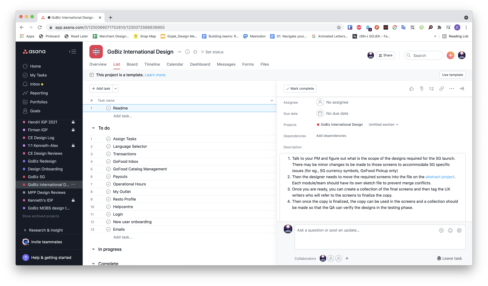
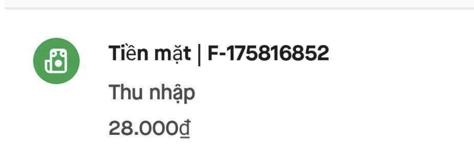

At Practo, I had my first experience designing for markets outside India. Singapore was one of the strongest regions for the Practo Ray product, and it encouraged us to build features tailored to their dentists like [Dental Charting](https://help.practo.com/practo-ray/emr/dental-emr/all-about-dental-charting/).

By 2015, we began rolling out the doctor app to Malaysia, Indonesia, the Philippines, and Brazil. Looking back, our localisation efforts were still fairly shallow. Most of the adjustments were limited to currency, date and number formatting, or small copy tweaks.

Scaling the GoBiz app to Thailand, Vietnam, and Singapore was completely different. Just translating the interface was not an option. We did research to understand local restaurant workflows (e.g., Hawker Centres in Singapore), worked with the local team to understand local terminologies and cultural nuances, and studied how food ordering worked.

### Collaboration and Organization
GoBiz functions as a platform with multiple teams contributing to it. So when we prepared for a new country launch, it became crucial to have a transparent and collaborative approach. That's where Asana came in. I created the 'GoBiz International Design' template and assigned tasks to the different designers. This functioned as our team's design tracker and was referenced during the weekly SOS meetings (Scrum of Scrums) run by the program managers.

As for designs, we used a separate Sketch file (in Abstract version control) rather than making changes in the existing files. This helped keep file sizes smaller, reduced merge conflicts in the Master branch, and made it easier for other teams to find the designs without having to check with us.

### Typography
Designing for languages that use only Latin characters is fairly straightforward because most fonts support them. With GoBiz, our responsibility went much deeper because we supported local scripts such as Thai, Vietnamese, and Simplified Chinese. Our brand typeface, Maison Neue, did not support these scripts, so the app fell back to system fonts. In Thailand, this caused visible inconsistencies in size and styling.
Many merchants used accessibility settings to increase their font size, which broke our layouts during the pilot.

Vietnamese had its own challenges. Missing glyphs resulted in broken, mismatched text because unsupported characters were rendered in a different fallback format.  
Maison Neue does not support several important Vietnamese glyphs such as ờ, ư, ằ, ố, ế, ữ, ả, ẻ, ễ, ỉ, ỏ, ủ, ư, ứ, ừ, ử, ữ, ự, ỷ.

To address this, I worked with the brand and design system leads to select a reliable fallback font. We chose Noto Sans, which is free, widely supported, and covered all the scripts we needed. Several months after the Thai launch, we also learned that printing receipts would require additional development to support Thai and Vietnamese fonts correctly.

##### P.S. "wkwkwkwk" and "5555555" are common ways of typing laughter in Indonesian and Thai texting culture.

### Managing Copy
Managing design files is relatively easy compared to managing multi-country copy. When we started supporting multiple languages, tools like Lokalise did not exist in our workflow. We relied entirely on Google Docs and Google Sheets.

When the product supported only Bahasa Indonesia, all GoBiz copy lived inside a single Google Doc. Over time, the document grew extremely long and slow. I had seen other teams use sheets for managing multi-language copy, so I worked with our UX writer, Lauditta, to create a template suited to our needs.

Developers manage strings using “keys,” and we needed a way to map each key to the right line of copy. We realised too late how important this mapping was. Migrating retroactively meant spending a large amount of time copy-pasting, verifying strings, and searching through sheets.

We also wanted screen references to help reviewers see copy in context. This was especially useful for UX writers in other countries, as well as QA and designers who did not speak the local languages. The release of Google Sheets’ “Insert picture in cell” feature was a huge help for this.
Gojek eventually moved to using [Lokalise](https://lokalise.com) for its copy management.

### Learnings
Scaling GoBiz across Thailand, Vietnam, and Singapore taught me that localisation is never something you add after the product is built. Even after launch, every new feature needs to be evaluated through the lens of each country. The same care you put into the initial rollout has to continue, otherwise the product quietly drifts back toward the needs of the base market.

There's also an organizational reality that often gets ignored. Supporting multiple markets properly sometimes requires reshaping how teams work, how decisions are made, and who is involved in the roadmap. But these shifts take time, and they rarely get prioritised unless there is a clear business outcome tied to them.

At Gojek, this misalignment became clear. Each international market operated under its own brand and leadership, which meant we couldn’t consistently involve those teams in product planning. As a result, our roadmaps naturally skewed toward Indonesia, and we only built out some must-have features for other countries.  

### Closing thoughts

Gojek eventually exited Thailand and Vietnam, and its presence in Singapore today is minimal. Looking back, designing GoBiz for other countries was a highly rewarding and learning experience. I got to experience new cultures and work with people from different nationalities. Those lessons stayed with us long after the product lines, org charts, and roadmaps changed.

