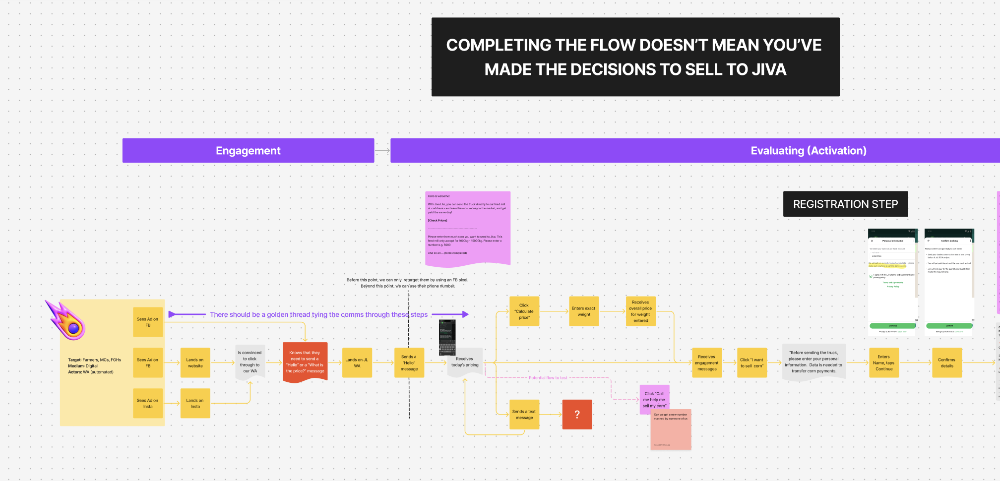
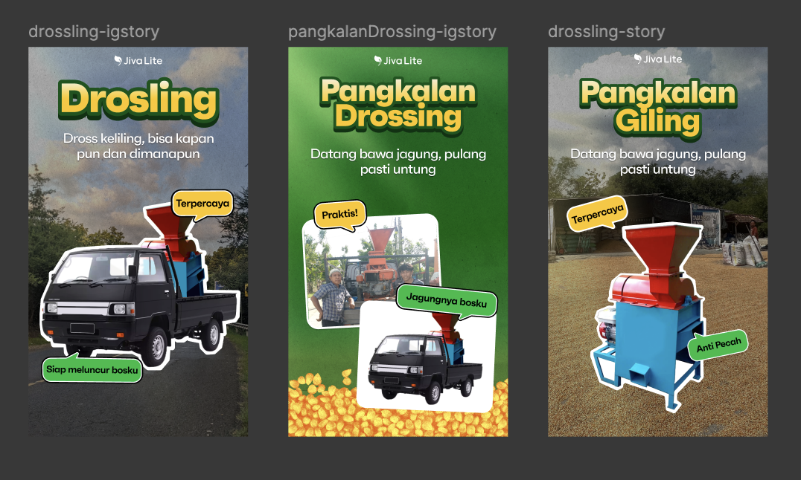
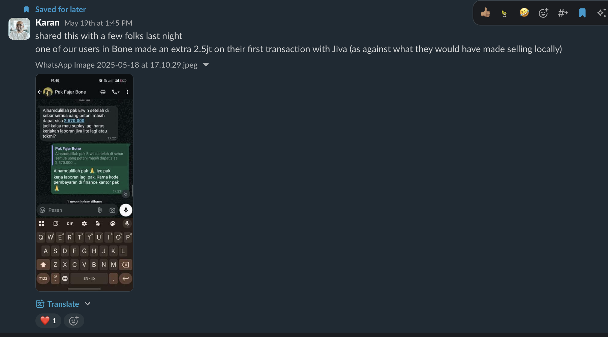

<!-- Add your project content here -->

When I joined Jiva in 2022, we had been leveraging collectors in rural areas to facilitate our business model.

The harvest of a smallholder corn farmer is typically around 2.5k-3k tons. The economics of sending it to the buyer isn't economically viable for such a small quantity when you factor in labour cost & transport cost. Additionally the ability to evaluate quality at the farmer level is approximate.
Collectors helped fill this gap by aggregating corn for dispatch from multiple farmers and using moisture meters to estimate quality of the corn. 

[Pricing Graphic]
[Corn quality (and pricing) is measured in terms of the moisture content of the corn kernels]

Jiva’s business model was working with buyers to acquire purchase orders for the corn and coordinate with the collectors to dispatch to feedmills to get the best price. 
This wasn't a disruptionary model. The concept of middlemen have always existed in agricultural systems. What was different was the concept of a single entity who's presence across provinces helped get better prices. 
Our Collectors earned commission for selling through us and our Farmers got the best price. 

But the question remained.. **could we do even better?** and that's where Jiva Lite came in.

## Challenge

- One of the reasons we resorted to the micro-collector model was the technical literacy and mobile device penetration in rural Indonesia. Most farmers still used feature phones and many families just had a shared single device usually operated by the children or the wife. For those who did have a smartphone device, local storage and internet were critical constraints. 
It didn't make sense for them to keep our apps on their phones across seasons and our churn data suggested that as well.

- Our research had shown us that the Sahabat Jiva android app was a complex system compared to the real world way to buying and selling corn

- From the business side, this meant our customer acqusition funnel was fairly expensive and with the commissions and price fluctuations of the market, the Gross Contribution (GC) that we earned per kg was far below what we wanted to be at.

## Role
My role was a fluid one in the project where at the start I was leading the product design effort and managing stakeholders but eventually transitioned to co-owning the project and focusing on the digital marketing efforts over the 1 year of operation. 

## Solution

The first idea for Jiva Lite came out of our efforts to simplify the Sahabat Jiva App information architecture and workflows. But it took a few more months before we got a chance to try to solve this.
The overwhelming idea at that time was to make another app albeit a "lite" one. But a few of us felt that Whatsapp was the way to go. So I used Landbot to quickly prototype how a Whatsapp based flow would look like.

#### Why Whatsapp? 
Meta has deep penetration in Indonesia. Indonesia doesnt have net neutrality laws and hence Meta, Google, Netflix, etc have mobile plans that enabled unlimited usage of their services. 
This is one of the reason that Facebook and Whatsapp are the communication tool of choice in our users. This meant that 
we could be assured that unlike a mobile app, our target audience would definitely have Whatsapp on their phones.

After pitching this to leadership, we got buyin to use the Whatsapp flow as a pilot project to test out the viability of the Jiva Lite business model.

#### Why was Jiva Lite different?
- If Jiva Lite had to succeed then it should be economically viable while at the same time, it should not cannibalize our existing businesses. So the pricing logic we set was to keep our offering price at 100idr/kg less than the price we showed in our Sahabat Jiva app. 
- A recent tax exemption made it easy for us to operate at the small scale without needing unnecessary documentation like KTPs
- For the first time (probably), small holders could sell direct to our buyers irrespective of the volume of their harvest and get paid within a few hours.
- Meta Ads and Whatsapp QRs let users quickly get into our flow and check prices.

### Building the MVP
A small team got together to work on this part time. Designing the first flow to be as simple took a few iterations. We used Figma and FigJam a lot to align everyone and used Slack's inbuilt project management system to keep us on track.
Weekly syncs were run to share progress with the larger group of stakeholders and monthly meetings with the CEO.

Our first version was built using Whatsapp Flows and simplified the crop buying flow to just 3 steps; View Prices, Register and Send Truck. 
We offered farmers the option of selecting between 3 feedmills based on their corn quality. Prices would be updated everyday.

### Preparing for Go-To-Market

**Onboarding internal teams:**
We ran sessions with our field agents, customer service agents and marketing teams to onboard them onto the pilot project. I prepared an "objection handling" (a FAQ document) for CX team to use for answering any queries they may receive on their channels.
Speaking to our on-ground field agents helped us address their concerns about Jiva Lite and its impact on their operations.

**Selecting a region for piloting:**
We had to negotiate with stakeholders for selecting regions due to concerns around our existing micro-collector density as well as time of the year and , we decided to go with the regencies closest to Makassar (South Sulawesi) ; Maros and Takalar. 
This meant that the distances to be travelled by the farmers to our buyers were just a few hours away.

**On field marketing:**
We got 1 field marketer, Erwin, on loan from the growth team for the efforts on on-ground canvassing by meeting farmer groups (Gapoktans).

**Website:**
We built a website so that we could provide a social proof that Jiva Lite was infact an offering from Jiva and not a scam. The website had prices which we manually updated and directed users to the Whatsapp number.

**Doing things that don't scale:**
We didn't build an in-flow way to add a farmer's bank account details. We resorted instead to use a manual system of getting the information from the farmer and getting CX team to add them to the system. This enabled us to ship faster and prevented user error from entering the wrong information. Where possible we pre-filled dummy data (e.g., user address) in the backend because we didnt want to build without valdiating our idea at this stage.

## Post Launch of the MVP

We launched the first version to production on August 7th, but we didnt get our first transaction till Nav, Karan, Idul and Erwin visited Mr. Saripuddin and convinced him to send the corn to our collection centre.
On August 23rd, Saripuddin (seen in the cover image) became the first farmer to have sent us the corn directly. That first transaction was the litmus test that our systems failed, however with Karan co-ordinating with Erwin, we somehow managed to pull through.

>“I made over IDR 3,000,000 with my truck! I invite all my friends to send trucks using Jiva Lite.”
> — Saripuddin

Saripuddin immediately saw the value Jiva Lite brought to him and instantly became our ambassador convincing multiple farmers in his village to send us corn over the year.
Within a month, we hit the milestone of 50 MT and started thinking of the next iteration for Jiva Lite.

Personally, the first transaction was a feeling unlike any other that my body had experienced. That day, I was unable to act rationally because I was completely blown away by the fact that 14 days after release we secured our first farmer and he saw the value we were providing. 
There was a lot of time and effort that went into reaching this exact point and it felt glorious.

## Learnings from the Pilot
**Selling breakdown:** we made a simple google sheets template to generate a breakdown that we sent to every farmer which helped them understand how much they were earning and what was the quality of their corn.

**Backend Issues:** We had not handled user creation of churned/deleted users and this is what caused our first transaction to fail. (Murphy's Law, amirite?)

**Changing behaviour isn't easy:** When farmers are used to dealing with a broken system, 'a too-good to be true' deal like Jiva Lite feels unrealistic. Furthermore, farmers and local buyers tend to have a personal relationship that isnt easy to overcome. At the end of the day, Jiva is an external entity while the buyer may be a neighbour, a relative or their money lender.

**Flow still complex:** Without our on-field agents, getting users to navigate Whatsapp Flows wasnt easy. Whatsapp flows may seem simple to us, but for our target users, they were complex. We realized that just because they used Facebook and Whatsapp didn't mean that they were familiar navigating similar interfaces. We needed to re-do our flow.

## Building V2

From a product point of view, we realised the following shortcomings:
- The current implementation didn't enable us to A/B test our flow fast enough. 
- There was no way for us to intervene in the flow to guide users through it if required
- There was no way to re-target and engage our users

We decided to look if any pre-existing solutions would help us solve this. After an evaluation of several Whatsapp business providers, we decided to go ahead with Landbot. We were already familiar with Landbot and it met all the above criteria.

**Product:** We re-designed the whole flow to be more like a chat-bot conversation as Landbot didnt support Whatsapp flows. This unfortunately took longer than we planned for and we finally released in early January 2025.

**Marketing:** While we built, we went ahead and started Meta Ads and sending Price Update notifications to users in our funnel. We felt the ads themselves may not be efficient at communicating the concept of Jiva Lite so Tyo and Nav created a few marketing videos to help us.

## Post V2

- Once Landbot released interacting with our users in the funnel became easy. Our Research Coordinators stepped in to own the role of helping guide our users through the funnel. They did a wonderful job (outside of their job description) and even converted a few sales purely via chat.

- Our successful pilot had enabled us to get a small budget approved which allowed us to hire a few more Jive Lite Operators (or JLO's as we called them) to do outreach on ground. We also explored using Sentinel satellite data to help our JLOs narrow their canvassing regions to those being harvested.

- We wanted to scale our solution to other regions so we started expanding to Lampung, Sumatra and Central Java and explored building out Jiva Lite for other crops like Rubber. 

- We ran A/B tests and simplified our flow futher. Designed different types of ads; static, videos, localized (Bugis and Bahasa Indonesia) and even engaged social media influencers.

## Final thoughts

- Our digital conversion (Ads - Whatsapp)was near 0 throughout the time of operation. We tried a lot of different approaches but weren't able to get any organic sale from the digital channel. 

- Almost 98% of our sales came via our JLOs. This meant scaling volume would directly need more feet on ground and that was seen as expensive.

- We uncovered certain systemic issues like Farmer debt, Cash payments (to avoid tax), Drossing systems. We attempted to solve Drossing (separating Corn kernels from Cob) by procuring and 
renting out drossing machines and even built a simple advertising based funnel to acquire potential customers for this service. but we couldn't solve for the others with our budgetary constraints.

- Though I have attempted to write out the project in detail, there is still a lot that I feel I have left out because building a product and running it takes you in so many different directions. You encounter various problems and inefficiencies and don't always end up solving them.
The experience takes a lot out of you but in the end, I am glad I got the opportunity to build a product with this level of ownership.

## Impact
In the one year of operation, we scaled Jiva Lite from 0 to 600 registered users who sold 4102 MT of corn. With a margin of 100 IDR/kg, we generated around 24k USD of gross contribution (Additional earnings from sales from trading this corn added an additional 200 IDR/kg, which has not been counted here)

Behaviourally though, we were about to bring meaningful improvements into the lives of the Farmers in a few provinces of South Sulawesi. Even after Jiva Lite shut down, a few of the farmers continued to deal directly with the collection centres and improve their collective earnings.

## Team
It takes a village to run a project like this and almost everyone in the Jiva design team contributed towards this project. I couldnt have done this without Karan owning the offline side, Nilesh running the product sprint and Shakti managing the JLO's. 

Nav, Sai and Tyo worked on the initial flow designs and Niraj took the reigns towards the end, Kesha on the UX copy, and Karan and Bharath on the Service Design. 
Asa, Idul, Aldi and El contributed heavily on the User research side often intervening in our workflow to helpg guide our Farmers. 
Akshay Koul led the Engineering team with Kalpesh and Mani, Rajlakshmi on QA. DJ for Data Dashboards. Gada and Salma on Marketing. Aiko & Idayanti helped us from the CX team.

And we really couldnt have done as much as we did without our Jiva Lite Operators Erwin, Firman, Rahma, Nur Faisyah, Ainun, Irsyam, Rajab & Fery.