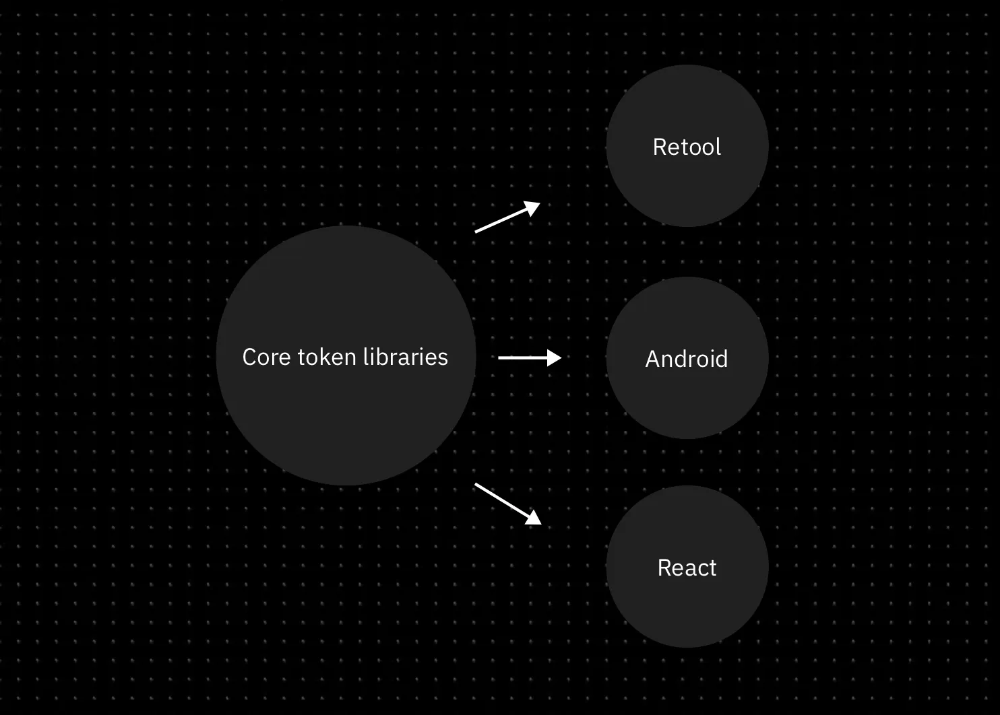
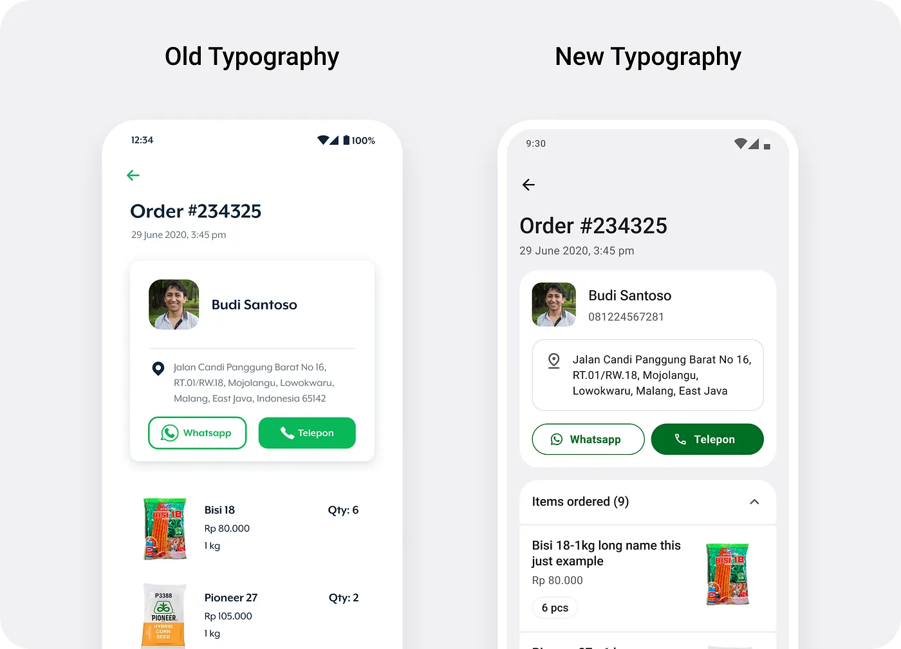
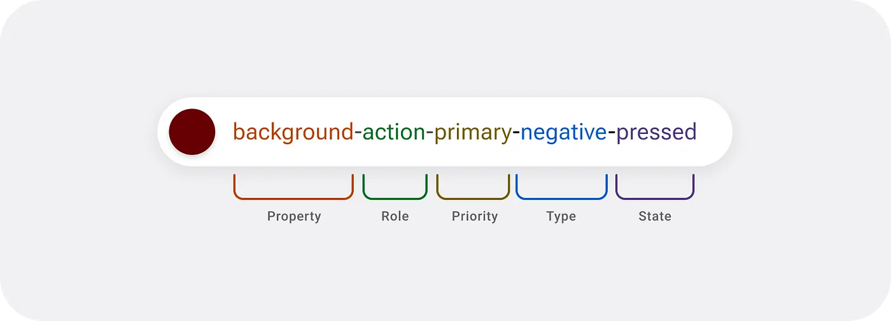
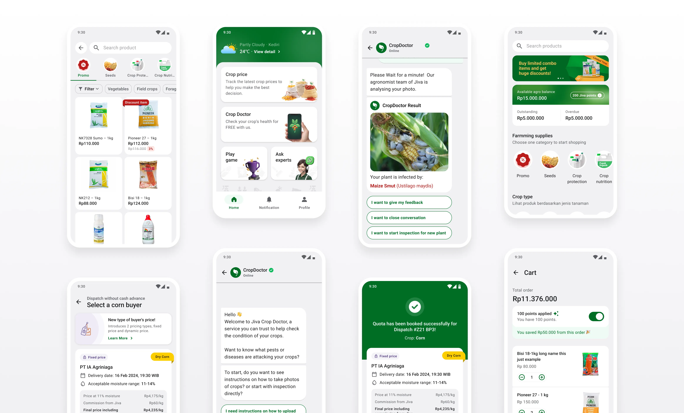

Design systems often represent an aspirational milestone for product design teams. But they’re often seen as an all-or-nothing project — something that takes months of planning and effort, 
while day-to-day product delivery suffers. When everything is moving at breakneck speed, it feels risky to divert resources into building a design system. 
**But is it really?**

In early 2022, Jiva was deep in the throes of hyper-growth, onboarding new team members almost every week. The chaos hit every part of the company, and the design team wasn’t immune. 
Work was being duplicated across pods, our user experience was inconsistent, accessibility needs were being overlooked, and our app’s 
performance was lagging behind.
At the time, we had a Figma-style guide, but it simply wasn’t enough. We needed more than a set of visual guidelines — we needed a 
comprehensive design system that could help us keep up with the rapid growth without adding friction to the process. And yet, we faced a tough constraint: 
our design team was tiny (and growing), so we had to approach this in a _lean_ way.

## Role
I led the effort on the design system and my responsibilities included managing with various stakeholders(product, engineering, qa), pitching ideas, 
defining the design system tokens, identifying the right tools and libraries. Post implementation, my focus was towards evangelizing the design system, getting buyin for implementing it onto the various product roadmaps and 
tracking its usage within products.

## Challenge

We set out with a clear set of goals for the design system:

### Goals

- **Scalability**  
Lay a foundation that would allow Jiva to scale across platforms and countries.

- **Speed**  
Remove friction in day-to-day work so designers could focus on designing, while product managers and developers knew exactly which components to use.

- **Output quality**  
Improve the handoff process so what was designed could be built accurately.

- **Accessibility**  
Bring typography and color usage in line with minimum WCAG guidelines.

- **Standardization**  
Create a coherent, consistent feel across all our products, reinforcing a sense of trust and legitimacy.

### Impact on our customers

- **Familiarity**  
Familiar patterns across products, reducing the learning curve.

- **Readability**  
Improved readability for older MCs, with better support for built-in phone accessibility features.

- **Performance**  
Faster, lighter apps through reduced duplication and a smaller overall app size.

## Getting started

It's easy to write down what we wanted to achieve with our design system but we had 0 experience designing one. 

We started by studying how well-known design systems such as Material Design, Shopify's Polaris, and Uber's Base were structured. 
We analyzed their token structures, naming conventions, and the rationale behind their choices. We watched talks, talked to peers, read blog posts and then we got started.

### Design Tokens

Design tokens represent the small, repeated design decisions that make up a design system's visual style. They replace static values, such as hex codes for color, with self-explanatory names. A token's value can be one of several things: a color, a typeface, a measurement, or even another token. 

 [^1]

We chose **colour** and **typography** as tokens in our system. We chose only these tokens because they gave the team the autonomy to move fast while giving us the flexibility to maintain consistency where it mattered.
All without locking us into a rigid design expression. These tokens could be used to create design “atoms” and “molecules” across different platforms, allowing our 
components to adapt naturally to each platform’s native constraints.
This flexibility was crucial. It allowed teams to move faster, design for different use cases, and scale without sacrificing brand coherence.

>For example, in 2024, when we built react native apps by adopting [Paper](https://reactnativepaper.com/), our tokens could easily be ported to make Paper-based apps feel like a Jiva product. 
>In tools like Retool, we only ported over colour tokens because that’s all we needed to ensure visual consistency. 
>This token-driven flexibility became the key to scaling design without getting bogged down by unnecessary rigidity like uniformity of components.
 
#### Typography

For Typography, we decided to lean on system defaults. On Android, by switching from [Mr. Eaves](https://fonts.adobe.com/fonts/mr-eaves-xl)(our brand font) to Roboto, we addressed the legibility issues we had previously
faced, particularly on budget Android devices. However, this wasn’t 
a simple swap. We had to design a type scale that ensured our transition was seamless and consistent across various text elements, from headings to body text.
for this was taking several key UI screens and replacing text to see how we could map the new type styles to the old ones with minimal effect to the UI.

#### Color

Colour, on the other hand, posed a unique challenge. Our original primary colour (#0AB858), vibrant as it was, didn’t meet [WCAG](https://www.w3.org/WAI/standards-guidelines/wcag/) contrast requirements, especially for text on white or green backgrounds in smaller font sizes. We knew this was a dealbreaker for accessibility.
Achieving the right contrast was tough — white on green rarely provides the necessary legibility, particularly on low-resolution displays. Finally with the help of 
Envoy’s post on [building an accessible colour scheme](https://medium.com/envoy-design/how-to-design-an-accessible-color-scheme-4a13ca12c92b), [Stark’s handy plugin](https://www.figma.com/community/plugin/732603254453395948/stark-contrast-accessibility-checker) and [Tailwind Color Generator plugin](https://www.figma.com/community/plugin/1242548152689430610/tailwind-css-color-generator), we found a modified shade of green(#006E25) 
that worked visually and was AA compliant. But colour wasn’t just about picking a new shade; 
we also had to write detailed guidelines for how and where it should be used to maintain consistency and accessibility across our products.

### Bringing it all together
M3 [(Material Design 3)](https://m3.material.io) had just released and we loved the fresh new style it brought with it. Material Design is built around a ‘primary’ color making it easy for 
people(read: devs) to adopt it. They provide you a [figma plugin](https://www.figma.com/community/plugin/1034969338659738588/material-theme-builder) to generate your color tokens but it lacks customization and is overly technical. 

Moreover, the way these tokens styled the components felt awkward to us. It did not fit our brand. So we decided to take control and create our own token system which we would map to these components.

During further research, we learned that there's no standardization of naming conventions across companies—each has its own needs and preferences. This situation challenged us, as we're new to design tokens and struggled to decide which approach we can go ahead with. It was only when we watched [this talk from Schema 2021](https://www.youtube.com/watch?v=ylDed18OVdY) titled *"Design tokens at Asana"* by Jina Anne, 
Ainsley Wagoner, and Ivy Wang that the solution finally dawned on us.

>Color tokens need to be comprehensive enough to clearly describe their usage, yet concise enough to make it easy to determine which tokens to apply.

We took the ideas from the talk and aimed to create tokens that are direct and self-explanatory. Our goal was to make them easily understandable by all and avoid designers needing to refer back to documentation to use the system. 

After a lot of discussions, we implemented the following structure structure designed for clarity and ease of use. It wasn't perfect, but it worked with a little bit of documentation better than Material Design's approach.

1. <ins>Property</ins> We start with what we call ‘property’, thus called because it defines what kind of element it is applied to; content, background or border. So for a primary button below, the color token for the text uses the content property while the colour of the button is represented by the background property.
2. <ins>Roles</ins> The ‘role’ aspect is where you start to identify the kind of component you are attempting to style. We use ‘Action’ for components that need the user to ‘act’ on them while ‘Highlight’ and ‘Interactive’ are used for communicating a system reaction to the user. We have ‘default’ for neutral colours and ‘decorative’ was introduced at a later point for components like badges and tags that needed to be visually appealing.
3. <ins>Priority</ins> Priority is used to optimize the visual hierarchy within the user interface, ensuring that the most important elements stand out and draw the user’s attention. By assigning different priority levels to components, we can guide users through the interface more intuitively, highlighting key actions, content, or information and making the overall experience more seamless and efficient.
4. <ins>Type</ins> Type is used to express the tone or meaning of an element, such as information, success, warning, error, or neutrality. These types are applied to components like buttons, banners, and toasts, as well as to elements like icons and text.
5. <ins>States</ins> States are visual indicators that communicate the current status or condition of a component or interactive element. They help users understand how an element is behaving at any given moment, such as whether it’s pressed, loading, selected, focused, or disabled.

### The Final stretch
If your design system exists only in Figma, then its just a style guide. For a design system to be truly complete, it needs to exists outside of Figma and as a code library.

We were re-writing our Android Front end in Jetpack Compose and decided to merge the two efforts to implement our design system. 
While having self-explanatory token naming certainly makes designers' lives easier, by taking this direction of deviating from Material Design's conventions, we increased our developement effort. 
We had to build a bridge to make our tokens compatible with material design. This wasn’t straightforward. Most big companies that we studied had UX engineering teams to help build such plugins for their use. 
We came across [Amazon’s style dictionary](https://github.com/style-dictionary/style-dictionary) from [this talk by Doordash](https://www.youtube.com/watch?v=jgueTz72ZMQ&t=760s) and Atlassian’s inhouse plugin in [their schema talk](https://www.youtube.com/watch?v=m8ZSu9eCsQc&t=814s) 
and the popular figma plugin [Tokens Studio](https://tokens.studio). 

>So why did we still proceed with this approach? We prioritized ease of use, recognizing that the development work to implement this system is a one-time investment. 
>We believed that it was a worthwhile trade-off.

It wasn’t really all that straightforward. We were only able to make it work by closely working with our developers(Sivan and Vishnu).

#### Our Approach
We used Tokens Studio to export our tokens from Figma as JSON and the devs had to figure out how to translate this to a setup that can be consumed by our apps. 
The aim was to make sure that the designers had the freedom to take decisions while the devs wouldn’t have to break a sweat in integrating them into the apps.

Our apps are on the Jetpack Compose framework and this meant that the design language and consumption were slightly different from Android’s traditional XML. 
We found [Lukas Opperman’s Design Token Transformer](https://github.com/lukasoppermann/design-token-transformer) to be a great tool for porting tokens to Web, 
iOS and Android’s XML system but we needed something that would support Jetpack Compose as well. So we forked this repo and decided to add support for Jetpack Compose. 
The overall idea was straightforward. The engine should take in the 
JSON file as the input, and spit out Compose Theming files that can be imported onto your project directly and the devs wouldn’t have to worry too much about the setup.

And that’s how we placed the final piece of our design system jigsaw puzzle.

## Presenting the Akar Design Sytem: 
All this while, we had been working hard on the system but we realised we didn’t have a name for our design system. We wanted something that resonated with the agritech space we were in, so we began brainstorming. Finally, with the help of Notion AI, we chose to go with Akar.

Akar, derived from the Bahasa Indonesia word for ‘root,’ perfectly reflects the role of our design system in providing a solid foundation for building products. It’s also symbolic, as Indonesia is where our products first took shape, making the name a meaningful nod to our origins.

### Post-launch
A design system's success is measure by its penetration and implementation by the team. Building it in isolation is bound to fail. Throughout the process, we spent time
involving the dev and design teams. We did this by 
- We created Slack channels to communicate updates and invite collaboration. 
- We presented the system at an org-wide ‘Lunch and Learn’ (an org level initiative to talk about work) to bring awareness to the initiative.
- To track adoption, we created pod-specific slack channels for devs and designers to have discussions around implementation and we set up a Notion page to track migration and adoption.
- We created a [documentation site](https://zeroheight.com/5c1eb1bd5/p/73e674-akar-design-system) which devs and designers could refer to. 

## Impact

Having Akar, helped us scale faster and build and redesign new apps and products in the Jiva ecosystem. As of September 2025, it was used across various platforms and products at Jiva, 
supporting our 3 core Android mobile apps (Sahabat Jiva, Jiva Petani, Jiva Agro). We also extended our tokens to be used in our internal React Native apps (Jiva Sales, Field Agent App), as well as internal tools built using Retool.

Implementation of the code components was a slow process as getting it prioritised over business needs was hard. 
We were able to get like 80% of the product verticals to completely use our libarary within the first 12 months. 

## Team
Tyo (who had just joined the team) worked with me and built out the Figma token and components system. Nav, (head of design), helped us take decisions
around the direction of the design components. Sivan and VIshnu were the devs who we collaborated closely to get the code components out in production.  

[^1]: **Spotify's Encore** https://spotify.design/article/can-i-get-an-encore-spotifys-design-system-three-years-on
