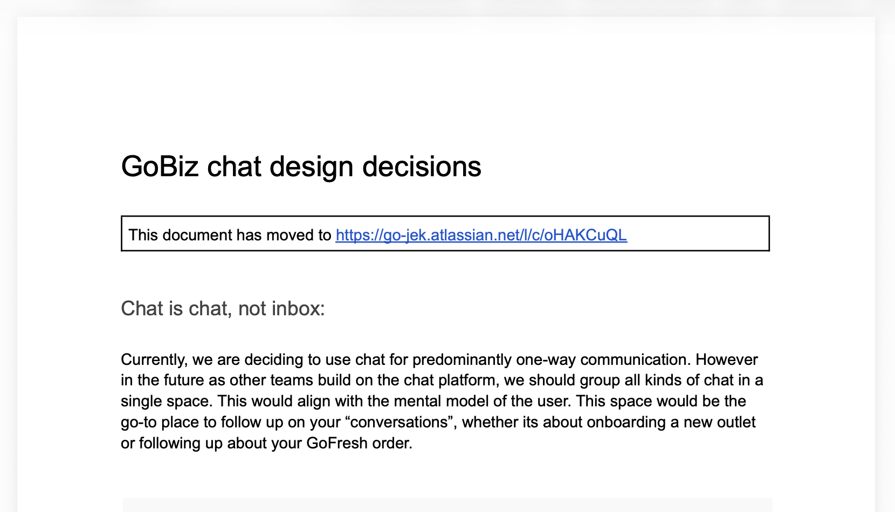
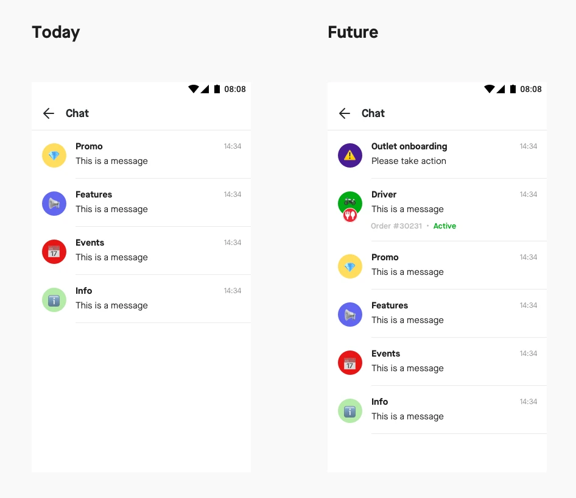

GoBiz is the superapp for Gojek's merchant partners. Gojek's 
1 million+ merchants used it daily to interact with their customers; food merchants accepted incoming orders, micro-merchants viewed their incoming payments, businesses setup their ads, managed their offline orders using the POS, etc. 

### Building a communication layer 

Our merchant marketing team historically relied on emails, and youtube to communicate to the customers. However most of our merchants weren't 'email' users and may not even have access to the emails they had used to signup anymore. Without a reliable communication channel, getting adoption to our newer features was difficult. So one of the important platform features we wanted to build to support this was a in-app notification centre.

The main Gojek app had adopted a Chat-like interface to be it's communication layer along with the Shuffle card framework. However like many other platformised products, the GoChat SDK ended up being promoted for integration across other Gojek apps.  We wanted to build an Inbox, an in-app channel for notifying our users. We just needed one-way communication. The Chat SDK was built for two-way communication for the Gojek mobile app. It didn't have a web equivalent while GoBiz needed the Inbox to work on web as well due to our quest for platform parity. Our bigger customers and business owners tended to only use the web interface. We needed a solution that had a plan to scale beyond the mobile and we found that the current implementation of the GoChat SDK lacking.

### Why this project?

As a platform designer on the B2B side, this wasn't my first experience with dog-fooding, but it was one that I was able to influence positively for the benefit of the users. That's why I chose to include project in my portfolio so that I can illustrate my approach when I encounter such decisions. 

### Visualize your argument

Decisions like this are often taken in isolation without understanding how they impact the product or its users. They are taken by leadership because of internal OKRs, a new business strategy or pivot in company positioning. I've seen rebrands being approved, new apps being created, internal tooling being exposed to customers, and so many more situations where the product vision takes a side-line. 

As a design owner for a product, I would want what is best for it and it's users. My strength lies in creating visual assets that can help communicate this. I make mockups and use them to create a document of possible directions and it's impact on the product in the future. 

### Align stakeholders

Share the document with them and invite them for a meeting where you can discuss the PRD. The format of this meeting depends on the problem you have at hand. Raise concerns on the decision's impact, offer them alternatives from your document. If you can get buy-in from other product and engineering peers prior to the meeting, you will help.

### Prototype and Test

Even with this, you will need data for your argument which you won't have at hand. If you have a robust research set up, then the next step is to conduct user research. We created 2 prototypes to run the test with our merchants.

  
  

Our research showed us that the SDK implementation wouldn't meet our user's needs and was complex for them. The research supported moving to a simpler version and we were able to align the SDK team to provide a view that would let us create that experience for our users.

