## Role
From 2019-2022, I worked on the merchant side of Gojek. GoBiz, Gojek's merchant platform, catered to 1M+ merchants across Indonesia, Vietnam(closed down in Sep 2024) and Thailand (sold to AirAsia in July 2021). The GoBiz Platform served GoFood merchants, GoPay Micro-merchants, as well as Enterprise merchants.

I started off as the designer tasked with redesigning the GoBiz Android app and eventually moved to lead the design on the GoBiz Platform contributing towards the design of the GoBiz app and website, the Spots app and the Midtrans website. Over this period of time, the design team at GoBiz grew to 12 designers with the mergers and acquisitions of Midtrans, Kartuku and Moka POS before eventually breaking up pre-IPO. 

## GoBiz app:
With the formation of a merchant team in mid 2018, I was the designer tasked with the redesign of the GoBiz app.

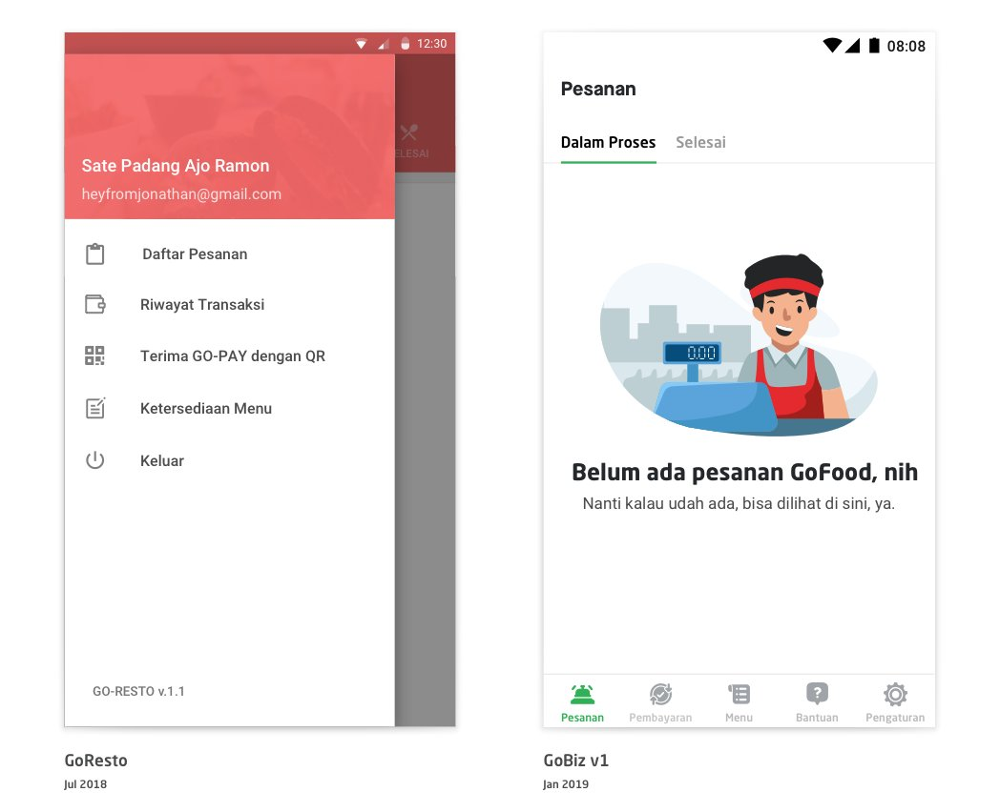
#### The objectives of the redesign were
1. <ins>Scalability:</ins> The old app 'Go-Resto' was moving from being a food merchant app to a merchant app used by different kinds of merchants. So we needed an information architecture that would work for GoFood, GoPay, and other merchants.
2. <ins>UI refresh:</ins> With the move, we rebranded from 'Go-Resto' to 'GoBiz' and adopted the newly minted [Asphalt 1.0](https://www.gojek.io/blog/of-dreams-deadlines-and-a-design-system) design language system. Due to the timing of the redesign, we were the first app in the Gojek ecosystem to be completely built on the new Asphalt design system. 

#### Design explorations:

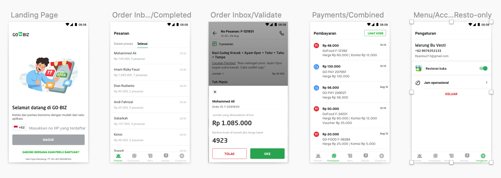

#### User testing:
We decided to have a pilot group of merchants for the release and the research team conducted a user diary research with them. 

As we had not changed any major flow, we did not find any issues. 

#### Learnings post release:
Once we released we started seeing feedback on the playstore asking us why we had hidden the customer contact. In the design, in the interest of showing the list of ordered items, we had moved the customer contact behind an overflow menu. Our analytics had shown low usage of this feature and we felt we could move it and add an onboarding tooltip for the merchants

However these complaints persisted and we followed up with a few merchants to understand the problem. We learned that though the merchants did not end up calling via the app, they would want to see the customer phone number either to collect it for marketing purpose, to call from another number or to identify if its a fraud order. 

Based on the feedback, we took a call to re-instate the customer number back on the order details screen. 
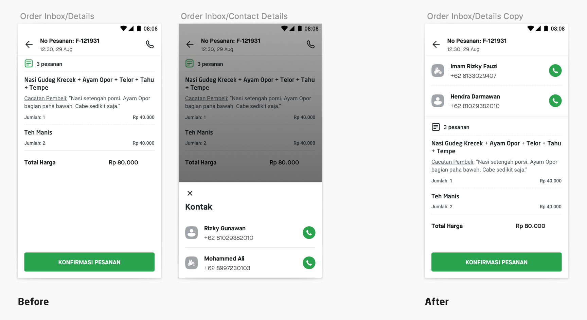

## GoBiz Dashboard:
Sometimes you just inherit a product that has not been loved. The GoBiz dashboard was built for enterprise merchants by forking an internal portal. The portal was built on an internal front end framework “[Tanjidor](https://en.wikipedia.org/wiki/Tanjidor)” and the designers used to design in the browser and this meant that there were no design files. This meant that there was a dependency on the existing designers. So we decided to pick it up as a design initiative.

#### Objectives of the redesign:
1. Reduce dependancy on the existing designer by
2. Make the dashboard accessible via mobile web

#### What we did:
In 2019, we (product design and research) conducted a heuristic evaluation to identify key issues. But post that due to issues with design bandwidth, the project was deprioritised. 

Fast forward to 2020, Hendri joined us on the GoBiz team and I assigned him to start work on the GoBiz Dashboard redesign as a way to familiarise himself with the product. 

We decided to design anything new with our web design system and not do it in the browser. Due to some luck, the “platformisation” of the Dashboard project got prioritised that quarter. However the PM was going to do it without a change to the UI. I convinced her to switch to the new UI. But given the sprint was beginning in 2 weeks, we were short of time. So we got a list of pages to work on a priority basis and started exploring. A lot of work was already done by Hendri however we had to now make the whole site look coherent. 

> You can arrive at a different output using the same design system.

We experimented with spacing and separators, navigation menu designs and modal overlays in the next 10 days to finalise the boilerplate for all the pages. Oh and yeah we also made it responsive. 

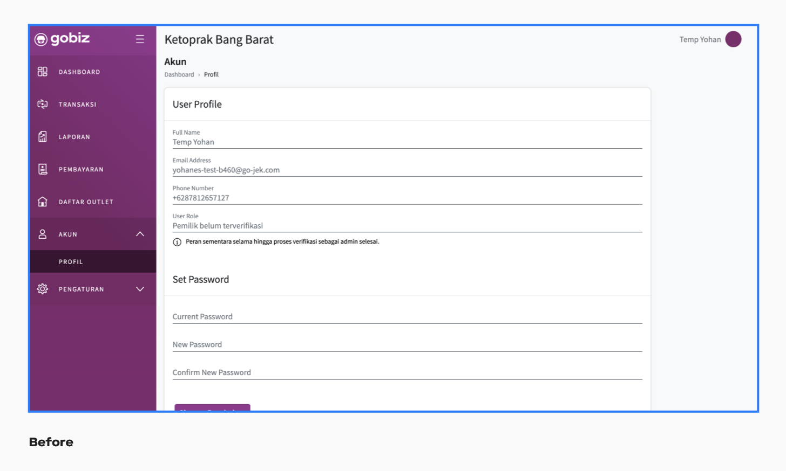

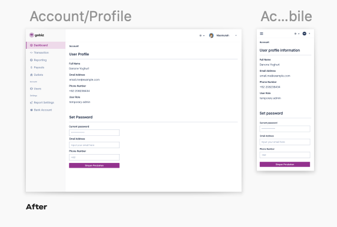

#### What we could not do:
* Fix the information architecture issues in every page. 
* Figure out a table design that works well on mobile and desktop

#### Outcome:
The GoMart designers were able to use the design system and build their module on the Dashboard with limited dependency on our team. 

## The Spots app:
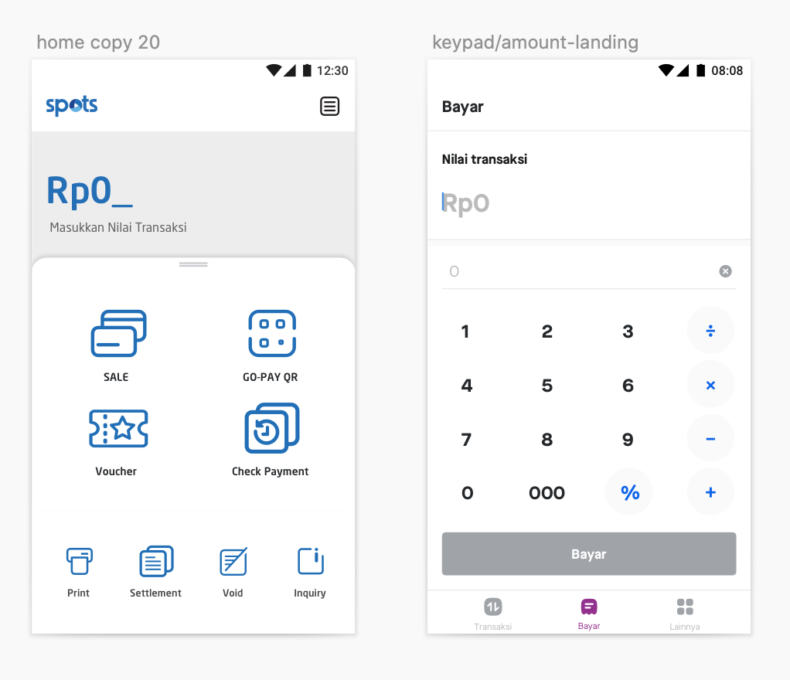
The SPOTS app was a point of sales app on a Landi device. We were selling these to offline merchants to let them collect payment via offline modes like credit card, debit card and QR. 

The app they were using was a reskinned version of the default app provided by Landi(image on the left). 

I was asked to help out with it and I worked on a refresh for the app on a short timeline(image on the right) 

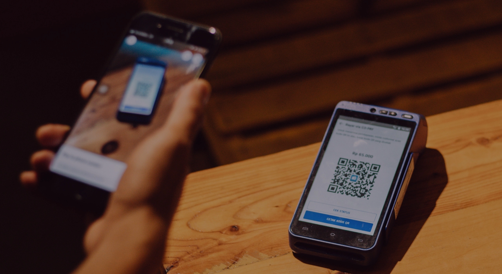

We later integrated this into the POS application on the GoBiz app. 

In 2024 during a visit to McDonalds, I chanced upon 

# Midtrans:
In 2020, the Midtrans merchant onboarding was prioritized due to an external collaboration with Whatsapp. 

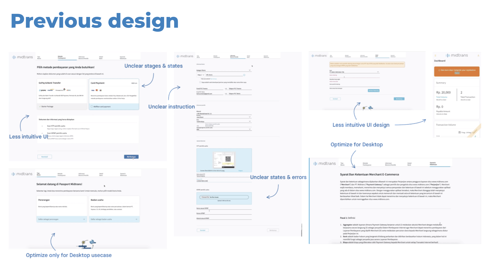

Given the urgency, I decided to ask Riyadhi to help the team with the wireframes. Riyadhi had previously worked on the merchant onboarding flow for the GoBiz app and I felt this would help us speed up the process. 

We had just completed the platformization exercise so Hendri and Firman were proficient with the new design system. The dev team too was confident that using the web design system was the best decision. This also made the flow mobile web compatible which was one of the identified merchant pain points. 

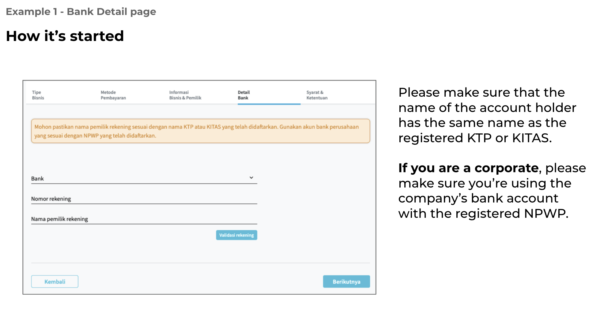
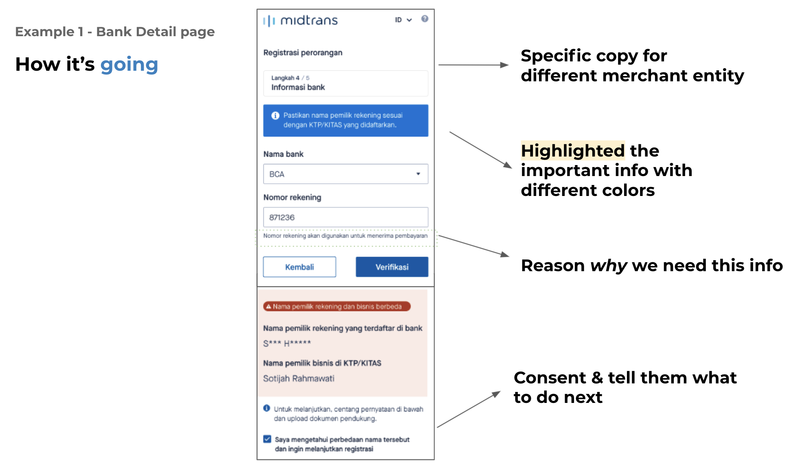

So we shipped the new onboarding and saw lot of reduction in the drop offs. 

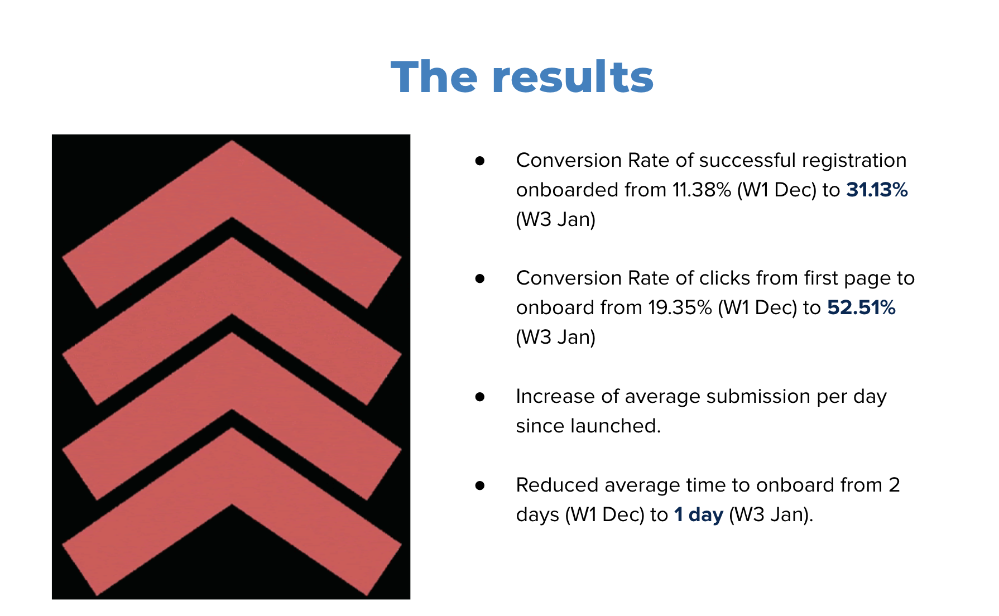

### Outcome:
This project exposed most of the team to the ‘merchant onboarding’ problem space and a surprising side-effect of this was that project handover of the ‘corporate onboarding’ project could be handled by Hendri when Riyadhi was affected by Covid-19.

#### Miscellaneous:
I consulted on the GoBiz and the Midtrans marketing website. 
