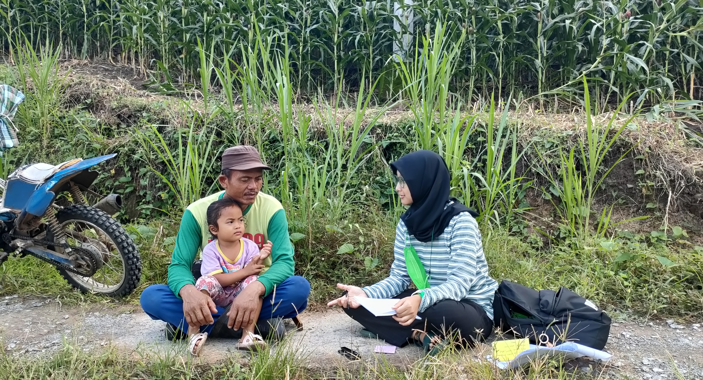
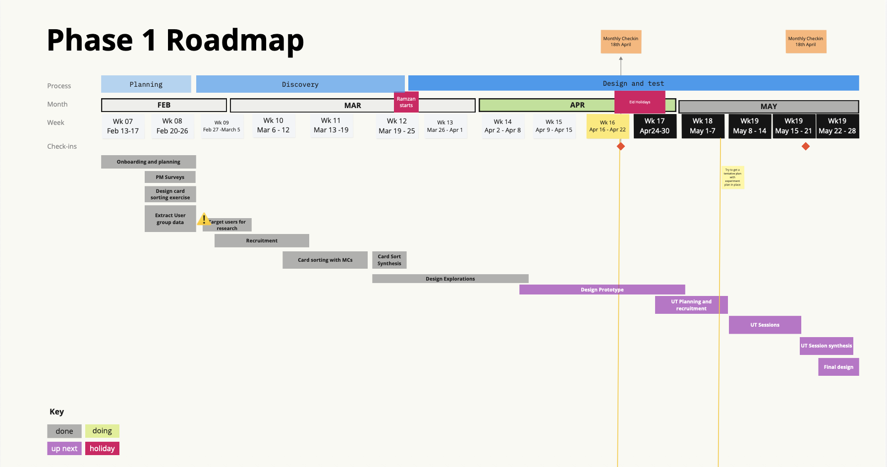
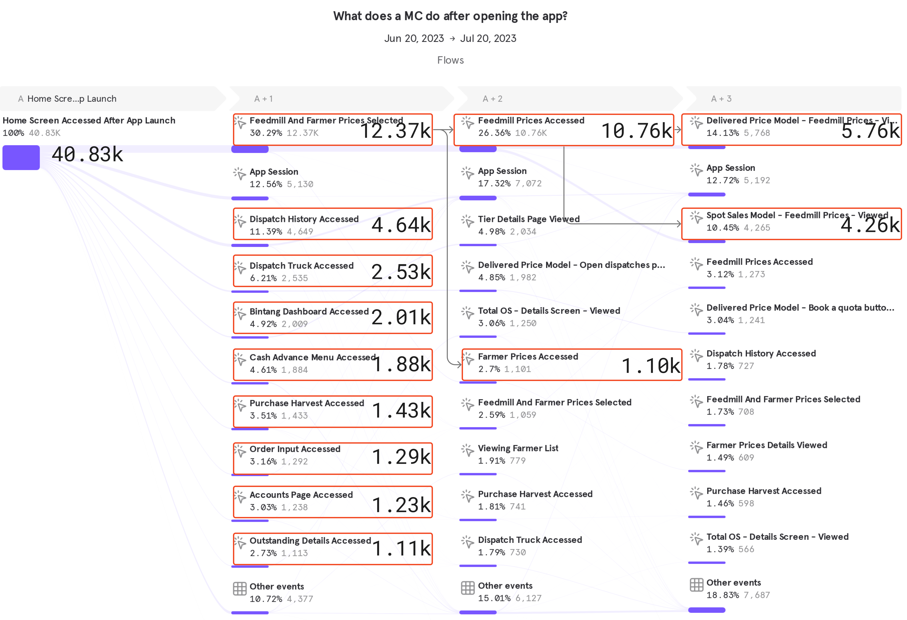
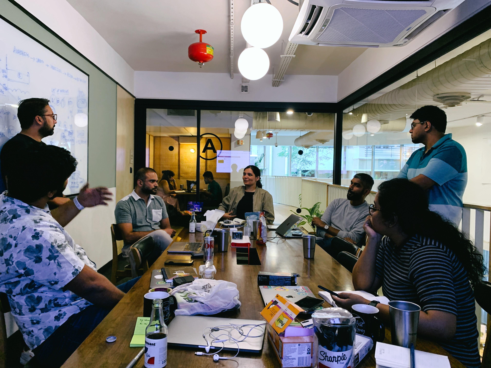
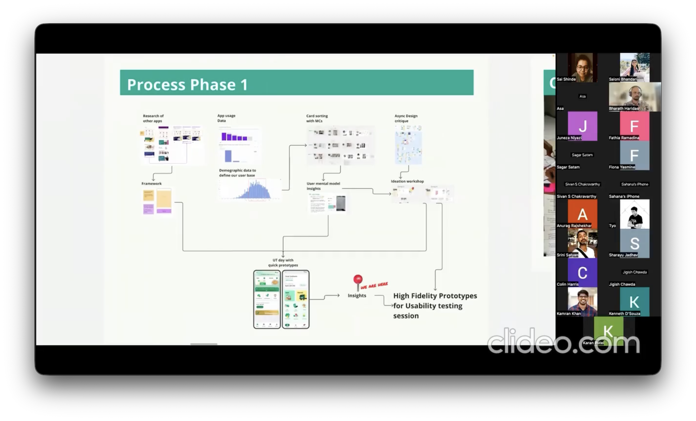
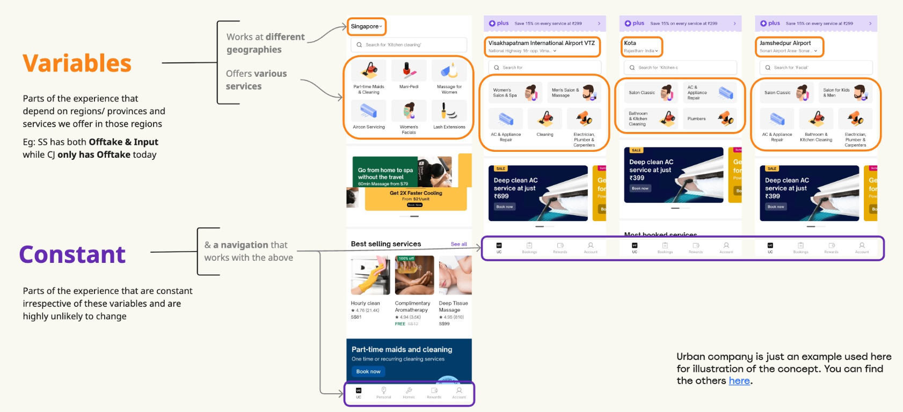
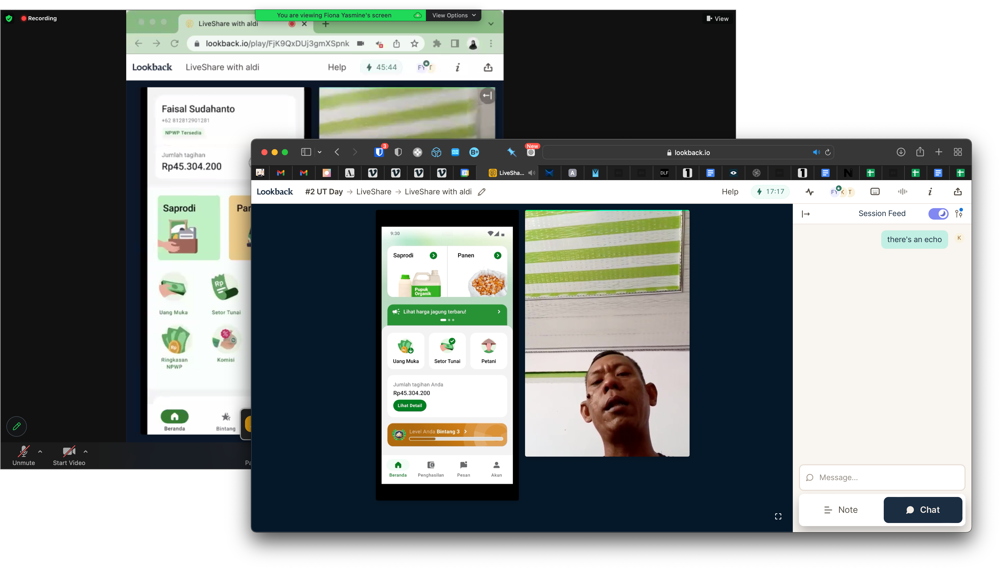
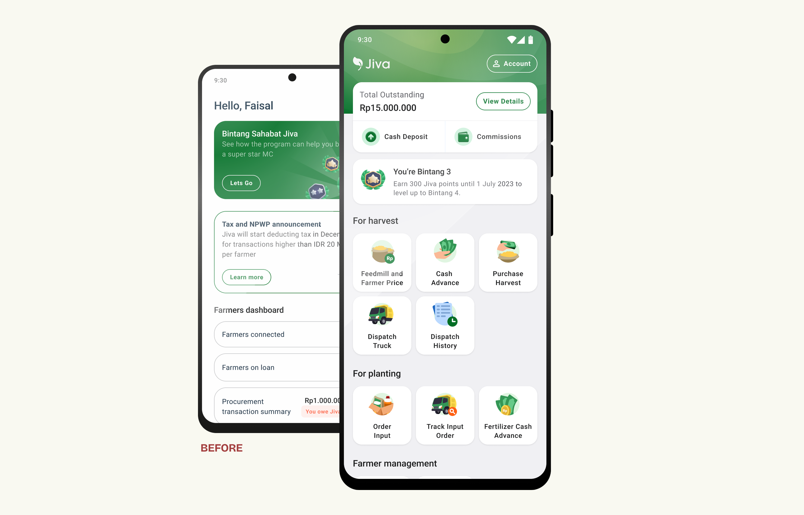
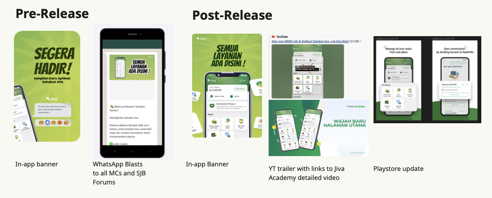
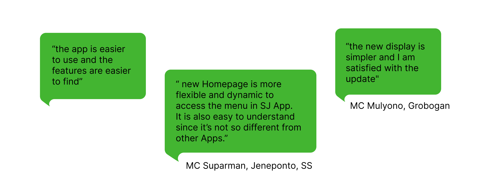

<!-- Add your project content here -->

When I joined Jiva in 2022, we had been leveraging collectors in rural areas to facilitate our business model.

The harvest of a smallholder corn farmer is typically around 2.5k-3k tons. The economics of sending it to the buyer isn't economically viable for such a small quantity when you factor in labour cost & transport cost. Additionally the ability to evaluate quality at the farmer level is approximate. 

Collectors helped fill this gap by aggregating corn for dispatch from multiple farmers and using moisture meters to estimate quality of the corn. Jiva's business model was working with buyers to acquire purchase orders for the corn and coordinate with the collectors to dispatch to feedmills to get the best price.

This wasn't a disruptionary model. The concept of middlemen have always existed in agricultural systems. Jiva and it's Collectors operated at a country level scale that hadn't been tried before. The Sahabat Jiva android app was used by our Collectors to manage their Harvest Procurement, their Input sales (In the Agriculture business; Seeds, Chemicals, Fertilizers, Equipments are collectively termed as Inputs) and view their Earnings.

## Challenge

Jiva had started off in the pandemic and we hadn't got a chance to observe our users on the ground. Moving to mobile apps had led to most of our transactions now flowing through a digital channel. However our qualitative research, quickly showed us that our users really struggled with our app. 

These could be narrowed down to
1. The app's localization was a mess since there had not been a dedicated UX Writer who was involved in the app in the past which led to wrong translations, english terms in various pages and alien terminology being used.
2. Every new user had to sit through multiple training sessions to learn how to use the various features on the app and there was no guarantee that they remembered how to use it.
3. There were many disconnected user flows which needed to be followed in a particular sequence.
4. The Collector's privileges on the application were managed by the province's branch manager and finance team due to the financial risk. This led to a non-uniform user experience and rogue user behaviour. 

Business-wise, this was leading to: 

1. High investment into canvassing, recruiting, training and onboarding 
2. Churn increasing Season-on-Season 

What this really meant was that the Android app was not the primary channel used by the Collector but more of a digitization system while most of the actual activity happened on Whatsapp. 

There were even cases where our field agents (Activation Co-ordinators, Finance Co-ordinators) may actually be the operators of the application as it had been mandated to digitize every transaction that flows through the system.

This was not a scalable business model as it was dependant on having more feet on ground to increase transactions. Our data had been lying all this while about product adoption and usage.

## Solution

Can you really solve a problem this systemic and prevalent at so many different levels? 

For sure! but could we do it at one go? No way. 

I advocated to break these problems into multiple phases. The aim here was to ship small and impactful to show value in the larger project to the stakeholders. Given the state the app was in, any change we brought in was definitely a net positive to our users. 

In this case study, I will talk (in brief) about the **Information Architecture** overhaul aka Phase 1.

Before we began redesigning, we needed to deeply understand our users’ mental models — how they think about tasks, organize information, and navigate the app.

To do this, we took a mixed-method research approach, combining qualitative and quantitative inputs from multiple sources:

**Card Sorting with Users:** 
On the ground, we spoke to users and conducted card sorting exercises to learn how users perceived and grouped key features. This gave us foundational insights into user mental models and navigation logic. (Cover image: I accompanied the research team in the field visits in South Sulawesi)

**Usage Data and CX Reports:** 
We analyzed historical usage data from CleverTap, Mixpanel, and UXCam, alongside customer experience reports, to surface patterns, popular flows, and pain points. One of our takeaways was that over the years, the quality of in-app tracking had degraded and the data we had couldn't be relied on. This was where I leveraged my expertise using data-tooling to extract insights for our use.

**Competitive Research:** 
We reviewed similar apps to understand how they structured information and workflows. This helped us identify best practices we could adapt to Jiva’s context.

**Stakeholder Interviews and Workshops:** 
As we knew that our data was in-accurate and prone to telling the wrong story, we had to rely on doing some qualitative research. We held workshops with branch managers, trainers, and on-ground teams. Their first-hand experience highlighted key gaps and opportunities that might not surface through analytics alone.

I've done these kind of projects many times over the years and it's fairly easy to know how to execute each of the steps above, but the challenge really is in bringing all this as well as align the people together in a coherent way.
![[monthly-checkpoint.png]]
The data from all these sources can be overwhelming to deal with and the design team often got stuck on how to go ahead. I had to step in to give direction on what we need to do next and keep moving forward.

We ended up with a framework, and created two variants to test out with our users. We had the research team do a quick field research (via [UT Days](https://medium.com/notes-from-the-fields/usability-testing-days-making-research-more-accessible-394525a052f4)) to fine tune our design before we started investing in building it out.

The feedback from the MCs we tested with showed us that the new design helped them with discoverability of actions and made navigation easier. This was something fairly obvious given the older UI we had, but having a [research artifact to show to stakeholders](https://medium.com/notes-from-the-fields/capturing-field-research-for-impactful-retelling-3e418a26036d) helps strengthen your argument for your design choices. We also learnt that they did not like the spot illustrations we had chosen as icons as they felt it made the app look childish. This was surprising insights, but as a design team, we decided to go ahead with our illustrative style as a more photo-realistic style seemed hard to pull off within our brand. Post this, we did one more round of research with a 'final' design before we built it out. 

## Release and Impact

As this was a huge change to the app, we had to run awareness sessions internally for CX, field staff, etc. We even made a ['trailer' video](https://youtube.com/shorts/F_0PHpDDuSE?feature=share) for the release. The new design shipped to 100% within a month of dev-handover. A transplant like this meshing two design styles within a single app creates some technical issues like incomplete layout rendering on some devices and cache issues but we were able to debug it and the release had a 99.3% crash free rate. Our in-app surveys, CX calls and post-launch user research, told us that the feedback from our users was overwhelmingly positive.

## Phase 2 and beyond
Phase 1 shipped successfully but unfortunately we hit a roadblock during Phase 2 with a difference in opinion about the priority of the project. Our research pointed out that our users needed a simpler system, but certain stakeholders didn't feel like this would help improve our business metrics. We were unable to convince them and so couldn't proceed with Phase 2 implementation. Some aspects of the work we did in Phase 2 eventually did see the light of day over the next few projects like how we re-designed [dispatch details](https://www.saishinde.com/work/jiva-dispatch-details). We were still committed to a better experience for our app users and concerned about scaling the product in the real world. Eventually a year later, we were able to build out [Jiva Lite](https://kenneth.dsouza.im/work/jiva-lite/)—the simplest transaction flow for our users that we envisioned during Phase 2.

## Role and Team
 I've been doing IA overhauls of mobile apps for the last decade so my role in this project was to provide the product design leadership and keep it moving forward. My badnwidth was spread across all the different product design projects and couldn't be working on this full time. Bharath Haridas from Service Design stepped in to program manage the project. Both of us were accountable to the outcome. Bharath was helped by Asatika from Design Research; the other full timer on the project. Nav (Decider), Sai, Saloni, Tyo also contributed their part time efforts on this project while the rest of the design research team helped us on the ground with field work.
