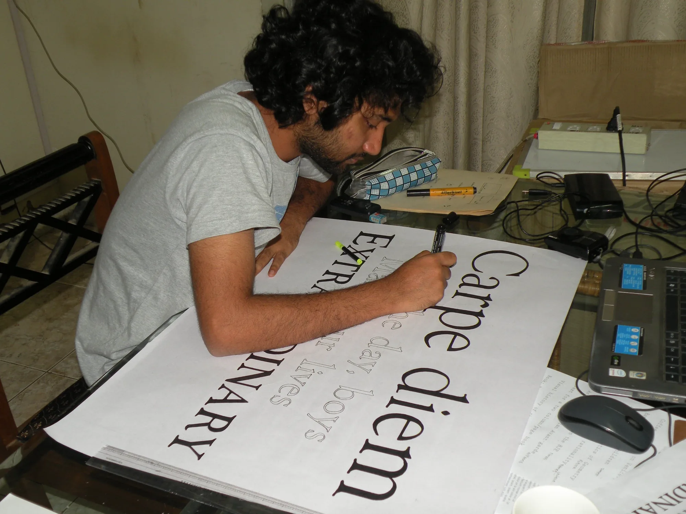
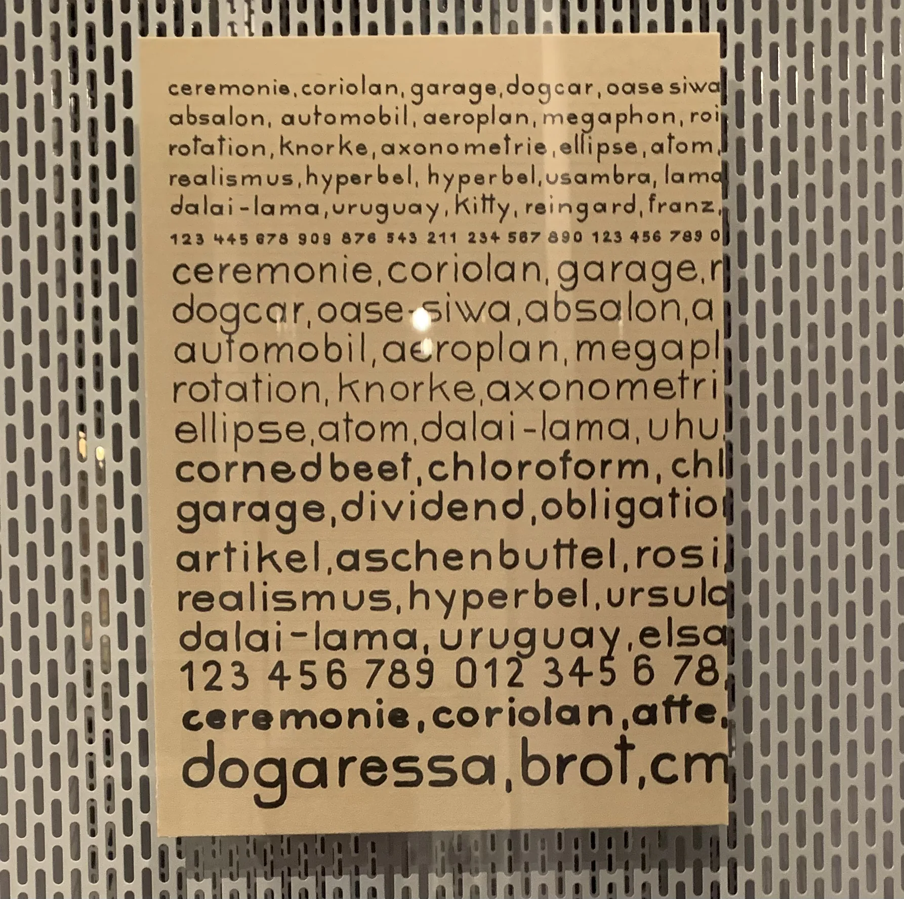

We are yet again in a state of flux where a formal education is being questioned. It’s not the first time we are here, though. In a capitalistic world, education may feel unnecessary if your goal is to earn, and you will find examples of people who have skipped it entirely and are doing well.[^1]

I am not one of them. 

Once upon a time, I was a young engineering grad who had just started exploring front-end design. I would download PSDs and work on new JS frameworks. I knew nothing about design. Heck, I didn’t even know you could get a degree in it. In 2011–12, a specific sequence of events led me into design school. I felt design school would teach me how to make websites and apps. Boy, was I wrong (and glad to have been). 

<!-- column widths match each image aspect ratio so both render at the same height -->

Design school pedagogy came as a surprise to me, someone who had spent all my life studying in traditional educational institutions that had subjects, exams and fixed time periods—working like clockwork through the academic year. Design school, on the other hand, had modules, assignments and juries with a lot of time left for you to explore. The syllabus began with Foundation. You’d think that means being taught the basics. It doesn’t. There are no teachers here, just faculty. You’re expected to start doing. If you had never drawn, or painted, or done craft, it’s a rude awakening as you see people around you excelling while whatever you do seems rubbish. You could give up, thinking that it’s a dead skill, or you could recognize you aren’t good enough. This is an important choice and one which governs what you do at design school. I’ve seen folks in my batch of 14 dismiss the need to draw type by hand on an A3 on a weekend[^2] since they felt you could get the same outcome on Illustrator. But the outcome was never the intention of the assignment. It was the journey.[^3]

> “Each time I sit myself down with fifteen, twenty, however many many books (or book covers), I give myself a fresh opportunity for observation and discovery. All of it fills up my creative cup. And depending on the other ingredients swirling around in this metaphorical cup on that day, I see different patterns and make different connections.”
>
> –– [Pooja Saxena](https://anexasajoop.in/blog/the-age-of-automation/)

Design school education isn’t really about making your portfolio or learning tools. A good design school would never optimise for teaching you tools, but rather teach you how to approach and tackle real problems, be it system design or group work. Design school gives you the freedom to develop yourself; it gives you a few years to step away, introspect and immerse yourself in trivial pursuits or while away the hours with friends. 

> “You get to follow ideas, develop taste, fail, and figure out what you actually care about as a designer!”
>
> –– [Jean Chen](https://x.com/jeanxcrj/status/2102525704298725851)

That brings us to the second important aspect of a design school: the people. You are going to be part of a cohort, one chosen by a panel and expected to work together and learn from each other. The people you spend your days with, and the conversations you have with them, will probably matter more than the faculty of the institution.

You will meet people and their obsessions(or witness the creation of a new one), you will learn from people about things you had no idea about (and perhaps start caring for those ideas), you will see people embark on long term projects (and maybe you will be  inspired to do the same. You will find yourself staying up late arguing about an idea, or partying till daylight (or both). If I were you, I wouldn’t miss this for the world. If I had to choose again, I would choose going to design school every time. They were some of the best days of my life. Though, in hindsight, I probably should have spent a little more of that time working.

As I end the post, I acknowledge that a good design school education is a privilege that few have access to. I am conscious of my privilege, and I am writing this post to implore those of you who are currently at the threshold of such a decision to take that leap of faith. You may not end up getting a job after it, but I hope you acquire an open mind, develop great friendships and make core memories in those years. Design school changed me, and I feel it was for the better. I didn't know it would when I was taking the leap, but I am so glad that I took it.

[^1]: Header image: taken at the Bauhaus Design Museum. From my archive.

[^2]: That’s me, hand-lettering a poster in design school. From my archive.

[^3]: Reinhold Rossig, specimen sheet from lessons with Joost Schmidt, 1929. Indian ink and pencil on paper. From my archive.
