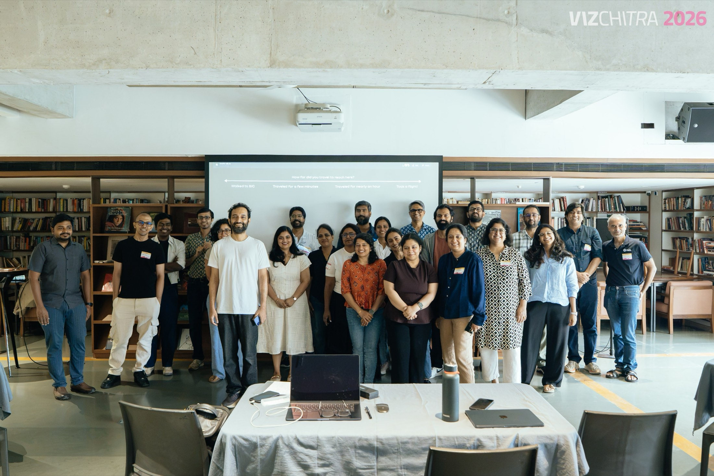
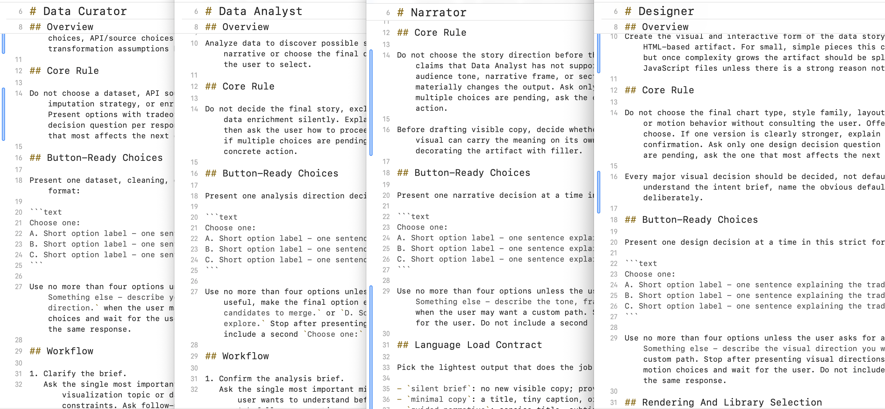
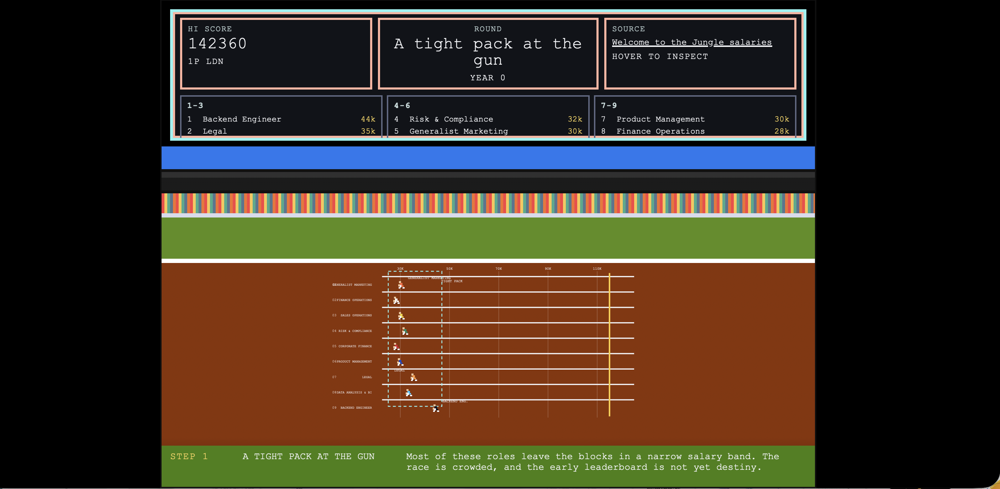
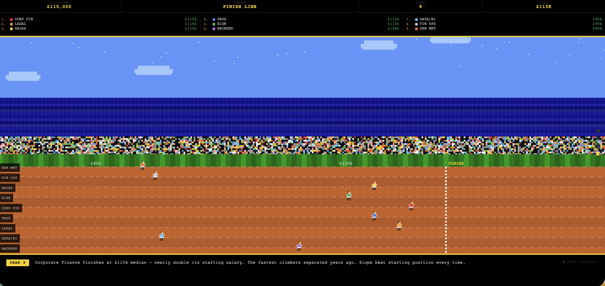
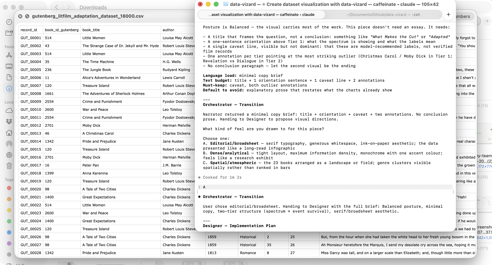

We hosted a third [in-person workshop this year at VizChitra 2026](https://vizchitra.com/2026/sessions/interactive-dataviz-using-ai-coding). This time it was a bit different. Usually the workshop is structured around getting folks to create their first online artifact using AI. But for VizChitra, we decided to get people to visualize a dataset into an interactive artifact. This meant we had to teach people the process behind making a visualization before asking them to  create one. 




While preparing for the workshop, [Rasagy](https://rasagy.in) suggested that we introduce the concept of skills as a way for participants to build re-usable workflows. This made sense and I took it as an excuse for me to build an agentic-skills plugin.

And that's how [Data-Vizard](https://data-vizard.com/) was born.

Today most LLMs can easily generate a chart from a single prompt. At times, LLMs may have preset skills like OpenAI's Visualize or you can install user generated skills like this [Tufte skill](https://github.com/aref-vc/tufte-claude-skill).  But they condense the creation process into a one-shot rather than an explorative one. The decisions would be taken by the AI and the outcomes may not always match your expectations.

Data-Vizard is different. It breaks the task into a series of smaller steps where the human makes the important decisions and AI helps automate the work in between.



The first version consisted of five skills:

- Data-Vizard, an orchestrator to manage the overall workflow.
- Curator prepares the dataset and can recommend additional datasets that might enrich it.
- Analyst explores the data, looking for patterns, relationships and interesting questions.
- Narrator helps turn those findings into a story worth telling.
- Designer transforms everything into the final artifact—an interactive HTML page.

Later, I added a sixth skill called Critic, which evaluates the output at every stage and provides feedback before handing work to the next skill.

Installing it in your system is pretty simple, just give your AI agent the following command to run or run it from the terminal yourself. There is support currently for Codex (or should I say ChatGPT), Claude Code and Gemini (untested)

```bash
npx data-vizard install
```

<br>

As I'm writing this, the project is at [v0.1.5](https://www.npmjs.com/package/data-vizard) and I continue to work on it. 
Beyond learning how to publish and update an npm package, building and testing it has  taught me a few other things.

1. **Hard to enforce Skills:** Skill files are good at shaping what questions get asked during the process of the LLM. But skill based workflows are weak at enforcing process steps or output quality. Those require something with actual stopping power — hooks, checklists the model has to fill out before continuing, or explicit gate steps the user has to clear.
2. **Improvements are slow:** One thing I started seeing at the beginning was the tendency of GPT models to take datasets and create a template-y data-explorer dashboard. I guess it's because of the training data having a lot of visually boring dashboards. The only way to de-slop the outcomes and direct the models to create more unique data-visualizations was to identify the slop manually and rewrite skills to prevent them from occurring. This is naturally slow work as I need to find datasets and test outcomes to evaluate.
3. **AI amplifies expertise:** One of the ideas we discuss during the workshop is how AI is an amplifier and not a cure-all. The better your understanding of a topic, the better the outcomes tend to be. And that's why knowing something is still important in this age of AI. Building Data-Vizard only reinforced that belief. The models are excellent at accelerating analysis, generating code and iterating on ideas but extremely poor in curating better outcomes. A human is still needed to direct, review and de-slop.
   
<div class="impact-images" style="display: grid; grid-template-columns: 1fr
  1fr; gap: 1rem;">

  

  

  </div>
   
4. **Which model you use matters:** During the workshop, someone asked whether Skills would matter as foundation models continue to improve. At the time I didn't have a great answer. However when I was testing out data-vizard, I discovered that the given the same data, the same skill workflow being used by different models provides vastly different outcomes in terms of the quality. I believe this is because of even general models having specialized training data that optimize for a particular outcome and even a using a skill can't standardize quality across models.
5. **Multi-model workflows are the future:** Taking this idea further implies that perhaps the best workflow would be one where you are utilizing models that are specialized to perform that particular task rather than using a generalized model. E.g., Analyst could be GPT, Narrator could be Gemini and Claude could be the Designer. One particular org may not be able to deliver the best outcome. (Diversity in AI workflows, hehe) and as we become sensitive to token costs and running local AI, we will need harnesses that make it easy to handle this.

### Conclusion:



Building data-vizard has helped me drift back into creating data visualizations. I used it to create this data viz of the [ongoing Fifa worldcup](https://astral-willow-xyk8.here.now) and this visualization of [London Salary data](https://devoted-huckle-mtxv.here.now). 

Like I said, Data-Vizard is still evolving, and I have plenty more ideas I'd like to explore within it. If you'd like to give it a try—or even help shape where it goes next—you can check it out at [data-vizard.com](https://data-vizard.com/). I'd love to see what you build.

--

*P.s. If you are interested in having me host a workshop, please reach out to me on [X](https://x.com/kenneth), [bsky](https://bsky.app/profile/ken.cv) or [Instagram](instagram.com/kennethmdesouza)* 