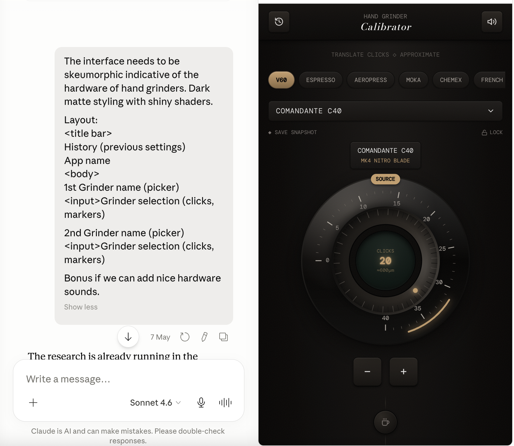
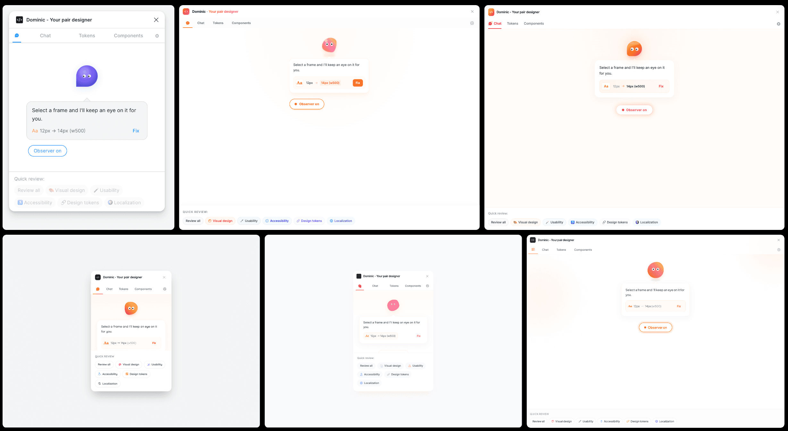

I've been making stuff almost every week (like this [threejs space-viz](https://eternal-nebula-33dy.here.now/) this week), not everything I make ends up being shared but there's a particular method to my madness.

### Measure twice, cut once
Most of my projects start their journey in a Claude Chat. Claude's research and artifact generation capabilities accessible from anywhere via mobile makes it easy to riff on the idea while on-the-go. Plus given my product and design experience, it's easy for me to do this as I can visualize designs and flows in my mind. 

If you are unclear about the technologies, you can get Claude to ask you questions to refine the idea. This conversation at the beginning of a project is like the understand phase of the design process.  

You can consider using [/grill-me](https://www.aihero.dev/my-grill-me-skill-has-gone-viral) as well.
### Ready, Set up, Go
The next step involves downloading the artifact (or plan.md, figma make file, etc) to my laptop and create a github repo to work in. Depending on the task and my situation, I spin up Claude on local or on cloud. 

Although I started using Claude via the cloud setup and moved to Claude Desktop, using Claude via terminal has been easier because it can do more for lazy old me without being buggy as Claude desktop. (note to anthropic: steal codex's reliability and not it's style) 

I don't use skills, etc at the start. I feel [they are over-rated](https://blog.jim-nielsen.com/2026/opacity-of-generative-tools/) and is like outsourcing your design decisions. I don't work with an org or a design system so making my own 'design.md' feels unnecessary. I rather spend this time finding references and making mood boards. I don't build complicated technical systems, so I don't worry about code quality either. Most of my projects are a single HTML file. YMMV.
### Rinse and Repeat
While I rarely use skills while creating, spawning sub-agents is something I've started to adopt. For e.g, for [grindsize.in](https://grindsize.in), where scaling the project would expect me to do repeated tasks, I employ 2 [sub-agents](https://github.com/inosaint/grinder-calibrator/tree/main/.claude/agents). I don't write these sub-agents, but just like my approach with skills, I ask Claude to generate them for me. When defining skills, I do specify the kind of model I want to power the sub-agent based on the task complexity and for token conservation. 

The process of creating sub-agents is similar to my process of creating skills. I make Claude create an outcome I plan. I test and review it. I make changes where required. Once I'm certain of the quality of the outcome, I check with Claude about making the process into an agent/skill. A point to note is that at times, certain process may work better as code rather than an agent. Listen to Claude.
### Tests, Evals...  🚀
Testing takes like 90% of my time on every project. Making everything responsive is hard and the browser space is fragmented and it has led me to some interesting browser specific bugs that have stumped the LLMs. ngl, it's feels great to solve them and I can do that because I understand a bit of web technology.  

Another thing I wish I did more of is *evals*. Evals helps me when I don't understand the code that is being written. I get another agent to review one agent's work. I consider it to be like a design critique or code review. To manage complex projects and usage limits, I keep a memory.md, agents.md and claude.md files to help with this back and forth.

If you are looking to use evals, consider impeccable's [critique](https://impeccable.style/docs/critique/) to see how it works,

### LLM based tools I currently use:
- **Claude Code:** Bulk of my work is done on Sonnet + API.
- **Codex (Free):** Mainly for evals and bug fixes
- **ChatGPT:** Prompt definition, Image gen, API
- **Gemini(Plus):** ImageGen, Deep Research and Prompt definition
- **Variant.com:** Amazing for a functional minded designer like me, not sure how long they can survive though.

--

*If you are non-technical and want to learn how to to use AI to build, you can check out my free guide at [howtoaicode.com](https://howtoaicode.com)*
