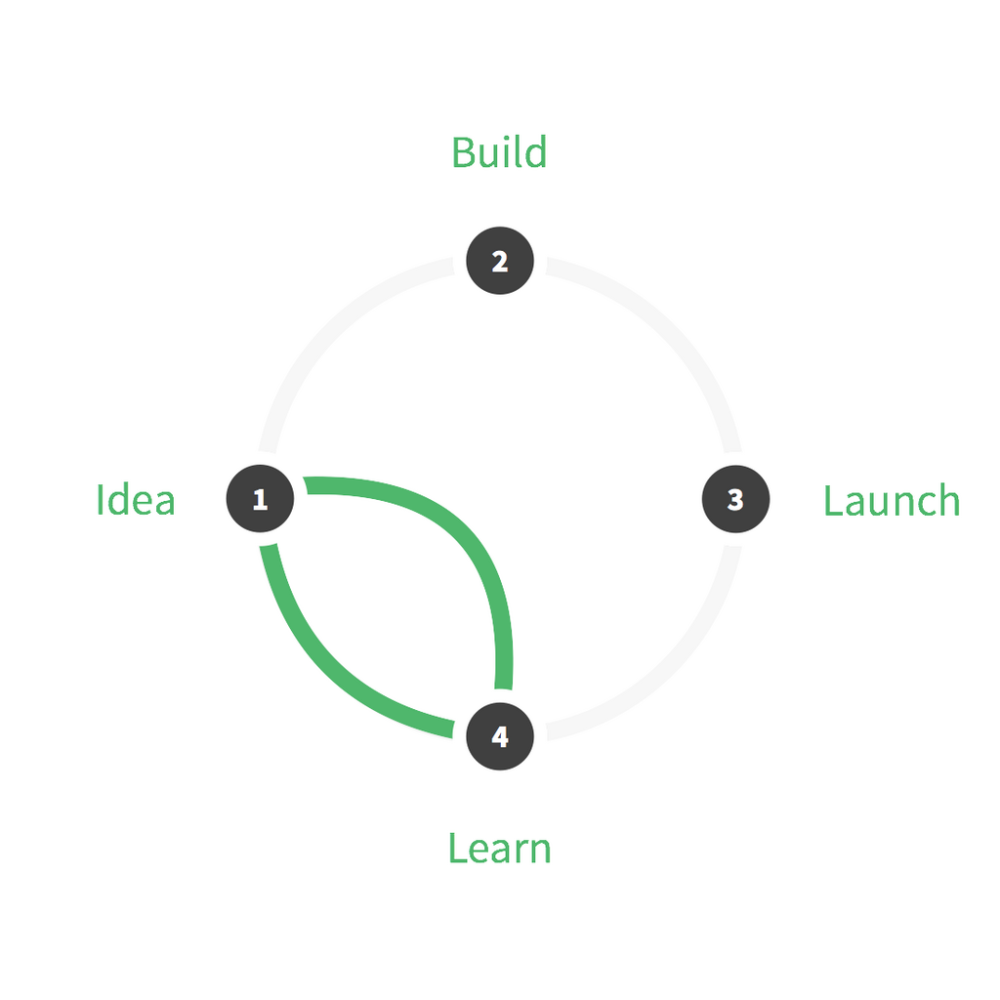
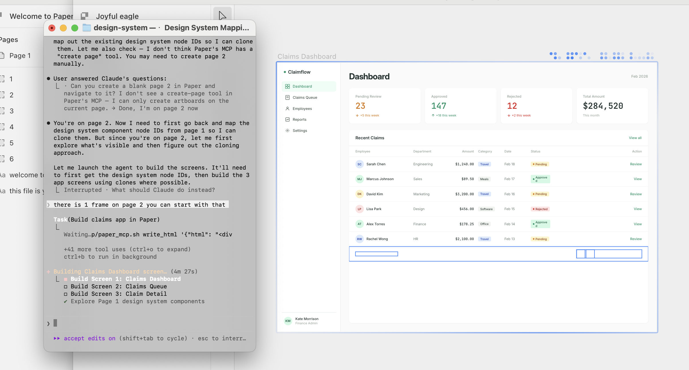

I’ve been building with AI for the past few months and I dont think the design process is dead.

## Speaking ill of the dead

Over the last couple of decades, people have tried to  tamed and commoditize the design process into a neat  package especially in the software startup world. 

This in-turn had led to designer portfolios filled with a templatic story of research, personas, wireframes and final output[^1]. A predictable sequence manufactured (often in retrospect) to appease the hiring manager gods. This isn't what the design process is, but I can understand why it might feel that way. 

And I hope it dies.

The design process was and is really about building iteratively and learning from it. The design sprint tried to bring that back but I don’t think people noticed. It's far easier to look at competitors, or favour your own bias, than go out talk to users, dissect your product’s data and figure out what you really need to build. After all the cost of bad product decisions is only visible in hindsight, while the cost of user research is visible upfront. 

But when you are building products for users who aren’t like you, there is no replacement for the process. 

At Jiva.ag, we were building for rural Indonesia. Our users weren’t digital natives but often humans with limited technical literacy. We couldn’t really design products and systems for them without understanding their world. We needed to spend time with them, mapping their world and their ways of seeing, testing using scrappy prototypes and re-iterating to validate ideas before we sat down to build out the product. That’s how we understood how they made decisions, how the used the internet and what mattered to them.

## Long Live the design process
What AI can help with is to speed up such artifact creation, like synthesizing and transcribing research calls and videos, identifying patterns and insights, generating ecosystem maps based on the data, helping create archetypes and ofcourse faster iterations on the prototypes. 

1. With tools like Deep research, Notebook LLM and Claude Cowork, it’s easier than ever to create artifacts in the Understand Phase and arrive at a Objective.
2. Midjourney, Nanobanana and other imagegen models can help you create storyboards.
3. With LLMs and AI powered exploratory canvas tools like Figma and Miro, you could speed up the explorations of different ideas. Sacrificial prototypes can be made easily for early testing.
4. Variant UI and nano banana can help you explore possible visual directions for your project, or Claude Code/Codex can create iterations for you.
5. Claude Code and Codex can help make real high fidelity mockups to communicate your ideas to the team complete with documentation and detailing.
6. Cursor, Pencil.dev and Agentation.dev to help you design directly in your codebase and fix those UI bugs

All of these still need a human at the centre of it all (for now) making sense, knowing how to adapt to the situation and directing the project forward.

## What’s the current meta?

1. AI seems to work as an amplifier of your skills and knowledge. The outcome from AI tools is far superior from someone who has a broader understanding of the problem space/domain compared to a regular individual.
2. Designing directly with AI leads to the same pitfalls as the designing in the browser(insert tool of your choice) did.
	1. Seeing AI generate the artifact can cause designers to fixate[^2] on the way they see the solution. E.g, In a recent project, I spent a lot of time trying explore variations of an AI created artifact before stepping back and realizing that it did not make sense with respect to the bigger picture. I had to scrap days of work.
	2. While the argument against designing in the browser(tools) was because you end up being limited by your own skillset to manipulate css(layers). In AI’s terms, it’s about knowing how to prompt to get the outcomes you need. There is tooling (and workarounds) now that helps to some extent but the canvas is still the superior way to design if you want your outcome to look like what you envision.

3. LLM Models are not infallible (at the point of writing). Knowing when to switch between different models is key skill to develop. Specialized models exist and they can help you get better outcomes.

I for one, am excited about this new way of building and the   

[^1]: or beautiful dribbble UI or excessive animations that would frustrate the average user
[^2]: "Design fixation is a well-documented cognitive bias where a designer becomes stuck on a limited set of ideas, often influenced by prior knowledge, previous solutions, or dominant trends," explains design psychology expert Rachel A. Wood. [More here](https://www.livingetc.com/advice/what-is-design-fixation).
[^3]: Cover image courtesy: [The Double Diamond from the Design Council UK](https://www.designcouncil.org.uk/our-resources/the-double-diamond/)
[^4]: Design Sprint image: [Courtesy Wikipedia](https://en.wikipedia.org/wiki/Design_sprint).

