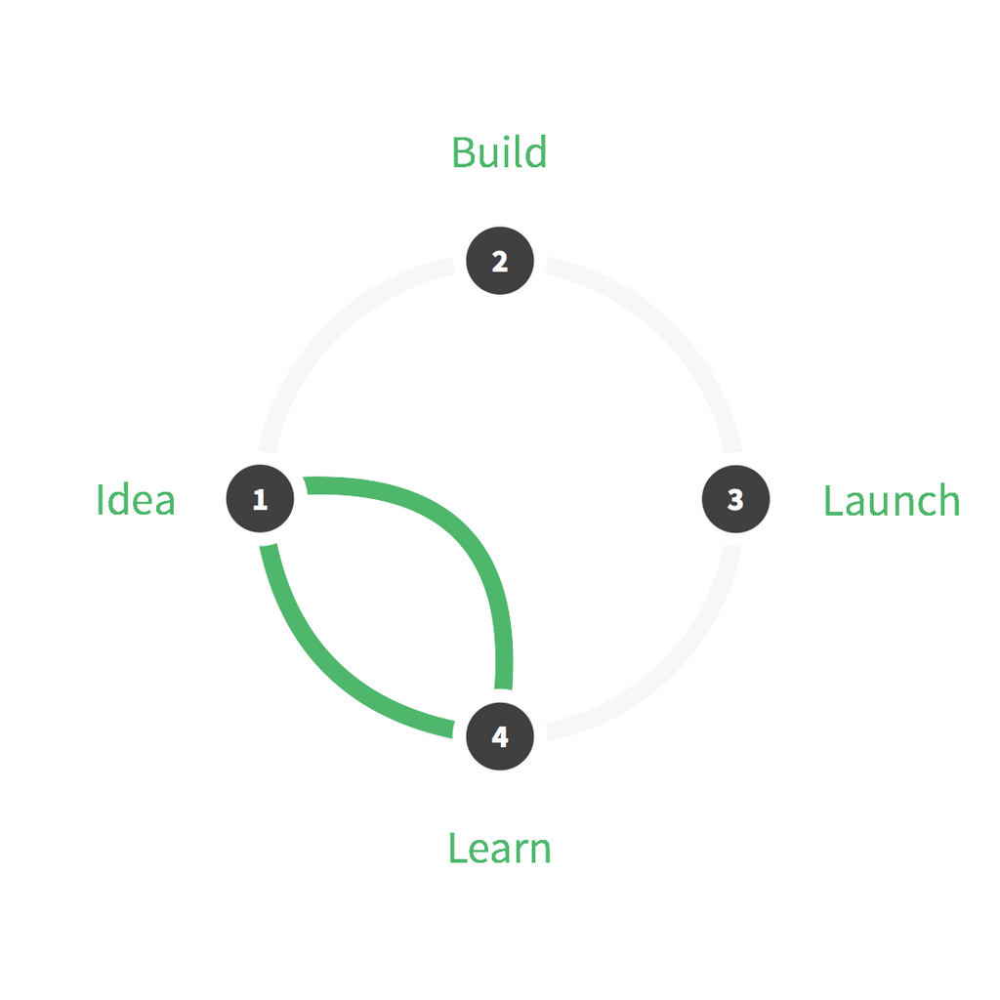
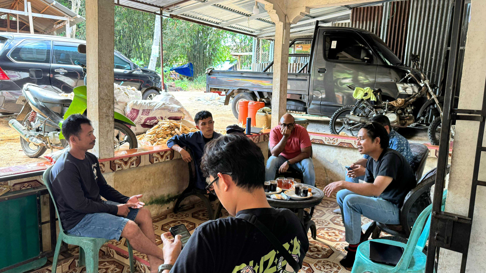

Over the last couple of decades, people have tried to tame and commoditize the design process into a neat package especially in the software startup world.

This in-turn had led to designer portfolios filled with a [templatic story](https://essays.uxdesign.cc/case-study-factory/) of research, personas, wireframes and final output[^1]. A predictable sequence manufactured (often in retrospect) to appease the hiring manager gods.

The design process was never about following a linear sequence. It wasn't about the artifacts or the rituals. It was just easy to market it as such.

The real design process was about making, testing, failing and learning – all in the quest for a better human centric product. It's far easier to build products and features by targeting "low hanging fruits", looking at what the competitors are doing, or favouring your CEO's bias. Much easier than going out to talk to your users, dissect your product’s data and figure out what you really need to build. After all, the cost of bad product decisions is only visible in hindsight, while the cost of user research is visible upfront. 

But when you are building products for users who aren’t like you, there is no replacement for the process. 

At Jiva.ag, we were building for rural Indonesia. Our users weren’t digital natives but often humans with limited technical literacy. We couldn’t really design products and systems for them sitting in our AC offices. We needed to spend time with them – mapping their world and understanding their ways. We tested with scrappy prototypes, iterating upon and validating ideas until we sat down to build. That’s how we understood how our customers used the internet, how they made decisions, and what mattered to them.

Yes, AI can help close the loop faster. But without a process, we would have designed for ourselves and not our users.

[^1]: or beautiful dribbble UI or excessive animations that would frustrate the average user
[^2]: "Design fixation is a well-documented cognitive bias where a designer becomes stuck on a limited set of ideas, often influenced by prior knowledge, previous solutions, or dominant trends," explains design psychology expert Rachel A. Wood. [More here](https://www.livingetc.com/advice/what-is-design-fixation).
[^3]: Cover image courtesy: [The Double Diamond from the Design Council UK](https://www.designcouncil.org.uk/our-resources/the-double-diamond/)
[^4]: Design Sprint image: [Courtesy Wikipedia](https://en.wikipedia.org/wiki/Design_sprint).

