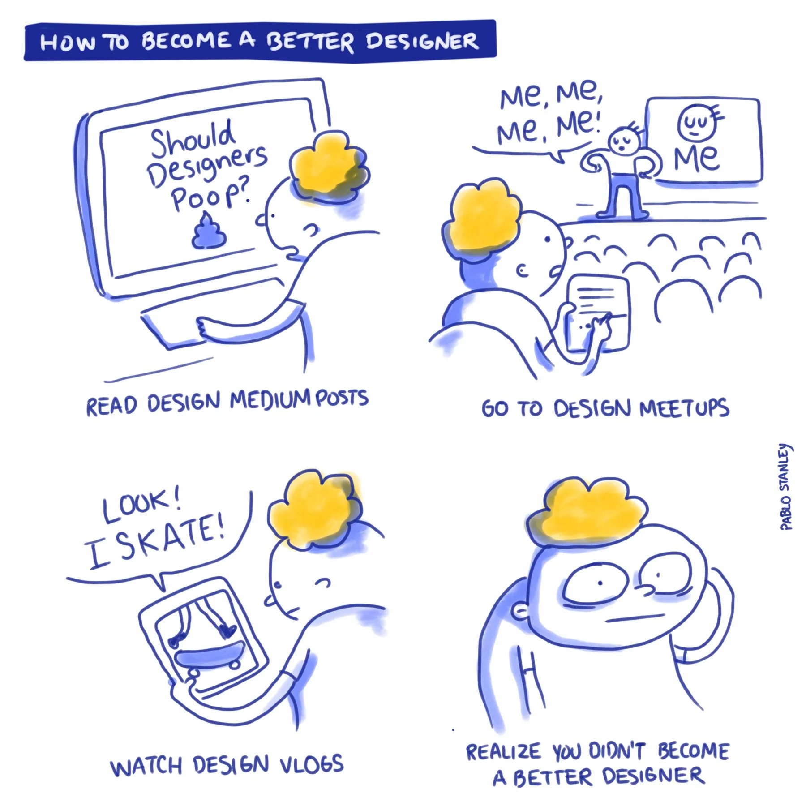

---
A decade ago, the ‘product designer’ title was being used to refer to designers (and still is) working on physical products. The adoption of using it for software designers got a shot in the arm when [Facebook adopted it](https://qr.ae/pGQdVi) for their designers. Until then UI/UX was the term of choice for folks in the industry and used to indicate a specific job that the designer performed in the team. This was indicative of the shift from the delivery teams working with client requirements (enterprise first) to product teams (rapidly iterating consumer tech) which had to learn and uncover what was the best product they could build. Due to the scarcity of product designers in the space, companies started acquiring design agencies around the world \[1\].

The ‘product designer’ now had to start looking at what they are designing as a product and not be restricted by your traditional mindset of UI and UX responsibilities. This would mean that they would need to learn about business, uncover user insights, use data analytic tools, have technical understanding, etc to design their product. These aren’t skills that come naturally to designers and there-in lay the problem. Not every designer wanted to be a “product designer” but it was an aspirational job for designers given the pay packages were miles ahead of what designers were paid in other industries. More and more companies started adopting the term of ‘product designer’ to follow industry trends and attract talent.

But even then there were few orgs which took design seriously.

![Source: 2014 interview in Dezeen [2]](./product-designer-1.png)

Even today, most orgs don’t really provide a space for designers to thrive in the product space and even today, there are probably a handful of product designers and product orgs in the world, the rest is mostly good PR.

And what are the aspects of a product designer that sets them apart from other designers?

### Quality

The primary aspect the product designer optimises for is quality of delivery. Quality being subjective makes it hard for the different disciplines to align over what this means. For me, it means that the product designer needs to understand the constraints of business and development to be able to deliver the best outcome possible in the defined timeline. You may want to build that perfect animated transition, but let’s be real, that’s not really a user need most of the time. The product’s usage and success should be the thing driving you towards excelling as a designer.

### Curiosity

Just like Alice, a product designer has to be inquisitive about their users and their behaviour and the systems they inhabit. The ‘product designer’ need to be comfortable looking at dashboards, analyzing events as well as drafting a research plan and talking to users. The best way to level up as a product designer is to learn from what you are building and putting out into the world. And this learning tends to compound as the years go by and helps you take decisions when faced with new design challenges.

### Craft

The product designer is actually [T-shaped](https://spotify.design/article/finding-your-t-shape-as-a-generalist-designer) despite a lot of folks thinking that they are generalists. So although the industry largely refers to the visual polish as ‘craft’, I don’t feel its restricted to just that. You could be a ‘product designer’ excelling at copy writing, or a ‘product designer’ inclined towards the code side. A good team is made of many such designers who can learn from each other. If every designer you hire (or in your team) has a similar skill set to you then there would be limited direction for you to grow in. Some teams out there have chosen to double down on this kind of team building but to me that’s building a design specialist team.

### Agency

This is a quality which is rare to find. I feel this is because most designers tend to be introverts and love to be comfortable in their “space”. It’s easy to spend time in the world making pixel perfection your entire personality, it’s not easy to go out on a limb and argue for a decision to be made. Unfortunately, agency is what helps you level up the ranks. Agency is what gets you a seat at the table. Another hurdle towards product designers developing agency is that they need to be part of good teams run by design leaders who support and sponsor you and those are really scarce in supply.

### So where do we go from here?

* I see that we need to address this at a system level, today the ‘product design’ comes with a better salary and so for designers to get better pay it’s better to call themselves Product Designers. So things can’t change until the hiring parties don’t get better at their jobs.

* No one designer is the same as the other. Organisations should be cognizant that there are no such thing as generalists and design their career rubrics in a way to suit the different kinds of designers on their team. This helps each designer to grow in their own way within the org.

* Job descriptions could be honest up front of the kind of designer that they are looking for rather than getting ChatGPT to write it. There is no point lying about this, infact it just takes you lot longer to find someone.

**Footnote:**

1. **John Maeda's Design in Tech report 2015, Slide 4** https://www.slideshare.net/slideshow/design-in-tech-report-2015-45858974/45858974
2. **Silicon Valley "didn't think a designer could build a company" says Airbnb co-founder Brian Chesky** https://www.dezeen.com/2014/01/28/silicon-valley-didnt-think-a-designer-could-build-a-company-interview-airbnb-co-founder-brian-chesky/
3. **Pablo Stanley, Collection of Random Comics** https://thedesignteam.io/collection-of-random-comics-d66f32ee9c52
4. Thumbnail courtesy, **The Process of Design Squiggle by Damien Newman, thedesignsquiggle.com**