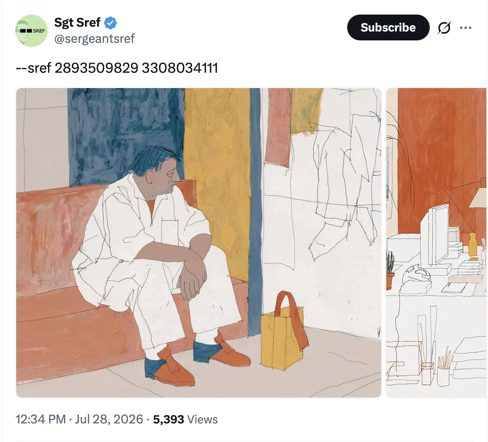
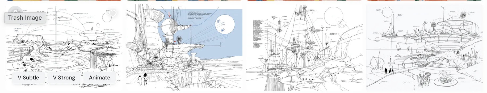
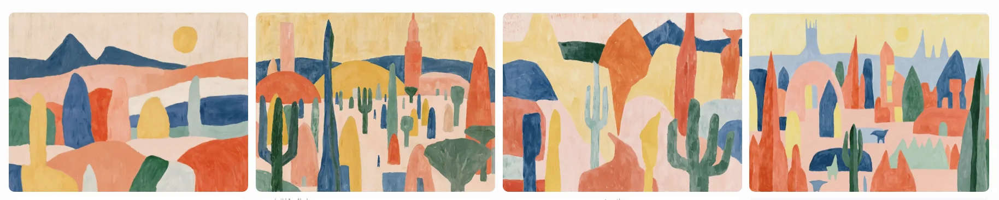
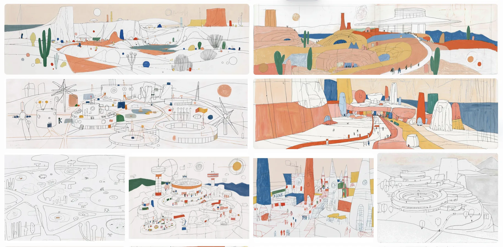
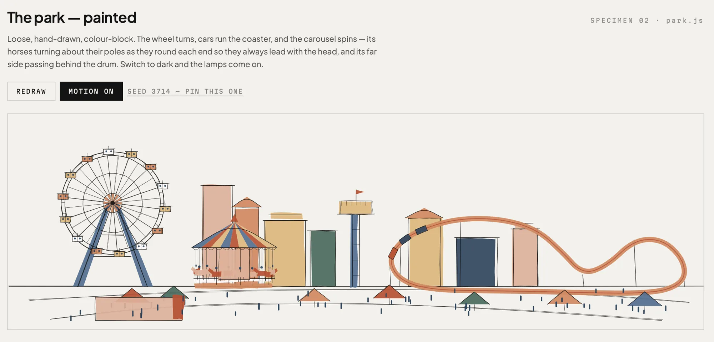
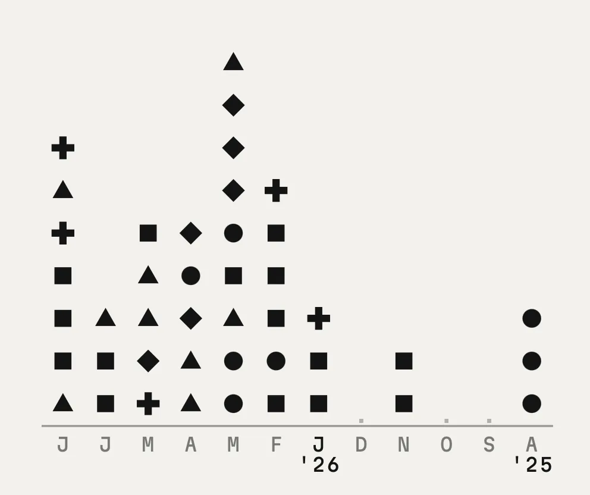
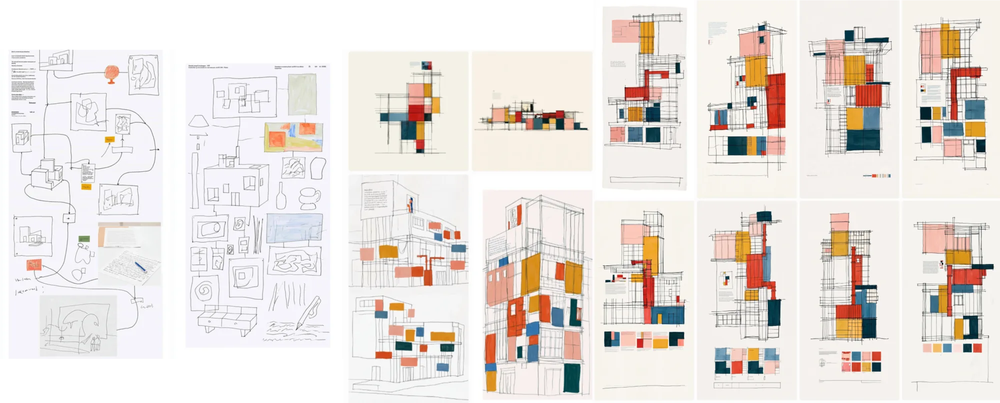
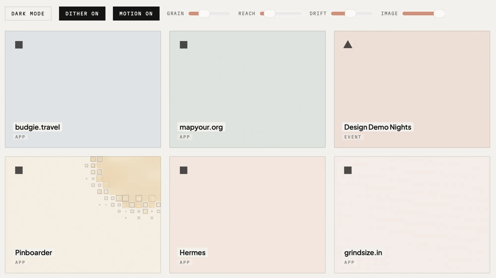
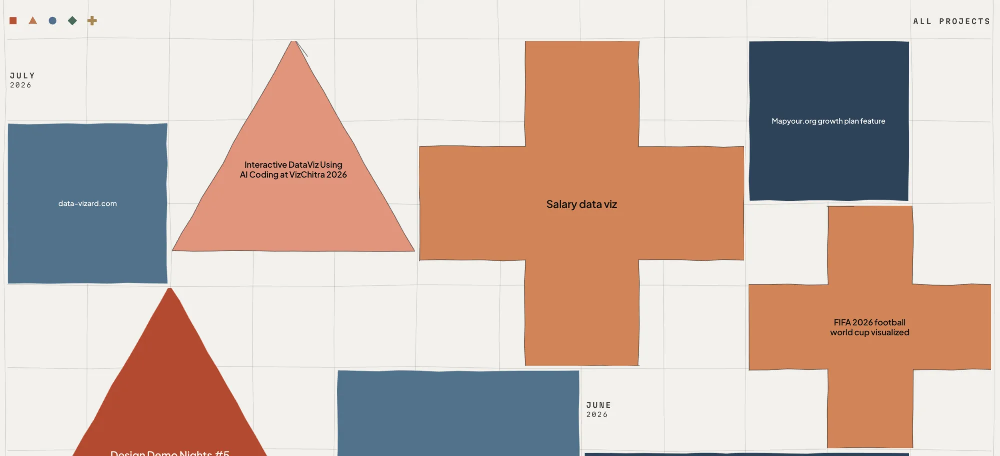

So a few weeks ago, I saw this post by [sgtsref](https://x.com/sergeantsref/status/2081999093677936900?s=20) and was enamoured by the rough lines and the color palette. I wanted to do something with it. I eventually gave in and bought a midjourney basic account to play with that sref combo.

This is how --sref 2893509829 looks like

and how —sref 3308034111 looks like

But together they created a beautiful output—greater than the sum of its parts to me. I felt this sref would create some lovely landscapes but I also wondered if I could make a website that was inspired from this visual style.  (aside: I’ve been tinkering with a LLM workflow to generate websites from an image moodboard) 

But hey i’m not really a visual designer but the more I looked at this, I felt that perhaps I could use elements from this as marginalia on a website—little pieces of animated movement.

The [AI projects page](https://kenneth.dsouza.im/ai/index-old.html) felt right for testing out this idea. I had rustled it up a few months back but it had grown a lot since. Recently I had added a *highlights* section but I know that having 6 projects for highlighting wouldn't be enough. But the real trigger was that this page was now linked to my speaker profile on the [designup.io](https://26.designup.io) site. The old design definitely didn't feel like a good way to introduce the current me. It was time for a re-design that fit the work I was doing.

So back to midjourney. Some of the midjourney explorations felt like mega-cities but that metaphor didn't work for a projects portfolio. I wanted to communicate playfulness and so themepark felt like the obvious imagery to explore. I used Midjourney to generate a few images based on the srefs and then asked Opus to create a footer. I used the file names as sort of annotation because I felt that helps communicate better than me typing. This may seem like insane behaviour to you but it works better than me trying to remember which screenshot in the 'inspiration' folder is referring to what. 

Opus created a footer study which was helpful for us to narrow down what we want to do with the themepark. The Carousel wasnt part of the initial version but I added it to balance the scene.

Then I had an itch to visualise the projects—a sort of meta-visualization and I created the grid-viz exploration. Each project had a category and the category was represented by a symbol and a color from our palette. 

Now the project grid seemed boring as a list, so I wondered if there was a way to communicate what I wanted to Opus. I went back and made a few more visual explorations. Opus though I wanted Mondrian (I understand why) and it created a version. From there it was tweaking the outcome. 

Next I felt that I could add some sort of visual-shader to the mix. Shader-study helped narrow the implementation. 

The website now looked complete but the theme park now looked out of place visually. Early feedback also pointed out what I felt, so I decided to re-do the themepark using the shapes. This time Opus added the floating balloons. Very interesting.

I also explored if the project list could work as shapes. Very bad idea. Because there's also another aspect to the page's design. The generative element. Each time you load the page, the grid changes, the theme-park changes, the balloons generate at random positions, a subtle hint to the behaviour of LLMs.

### But what about the type? 
The project started with an illustration as a starting point and went into designing like an artist making little studies before the actual painting but the typography wasn't thought of at all. Choosing type is ofcourse hard. I was looking at [Littleplains.com](https://littleplains.com) and found [Pangram Pangram](https://pangrampangram.com) and liked [PP Museum](https://pangrampangram.com/products/museum) and [PP Model](https://pangrampangram.com/products/model) but sadly, their EULA restricts free use from web so I went back to looking. 

My name starts with the letter K and I have strong opinions about it but I've not actually written it down. I had shared an early version of the page to [Pooja](https://www.matratype.com/about) (btw she was the one who gave me feedback to use the shapes throughout and I changed the theme-park implementation) and she asked me to verbalise what I meant. It was there at the back of my head but writing it down helps. While [Clash Display](https://www.fontshare.com/fonts/clash-display) is lovely, I hate how it's K looks like. I prefer type where the K has balanced arms (like in [Gill Sans](https://en.wikipedia.org/wiki/Gill_Sans)) or one where the leg is larger(like in [Cabinet](https://www.fontshare.com/fonts/cabinet-grotesk)). A more traditional view some might say. 

So with that clarity, I went back to looking specifically at the K's (but am also a sucker for nice humanist 'a's) and felt that '[Plus Jakarta Sans](https://www.fontshare.com/fonts/plus-jakarta-sans)' fits my needs. That it was designed by [TokoType](https://tokotype.com) and is named Jakarta was just a happy coincidence.

---

There's still work to be done of course. The image and video previews aren't there yet. I need to re-document that. I have also put-off writing about each project so far. Some do have their readme's but I should spend some time in the next month documenting the process behind the other work. 

Anyways go check out the current version of the site: https://kenneth.dsouza.im/ai/

