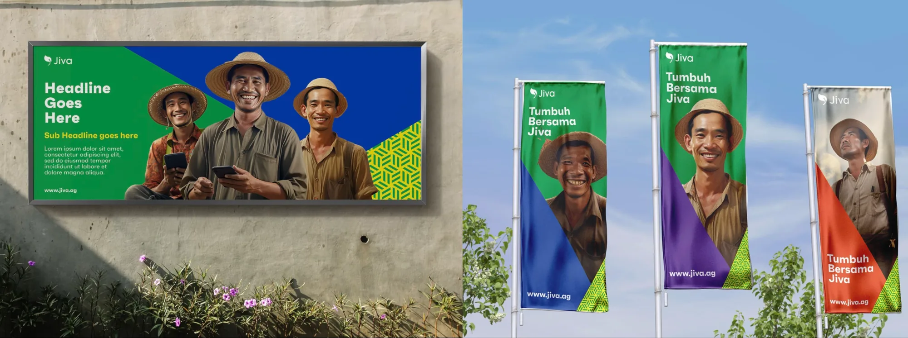
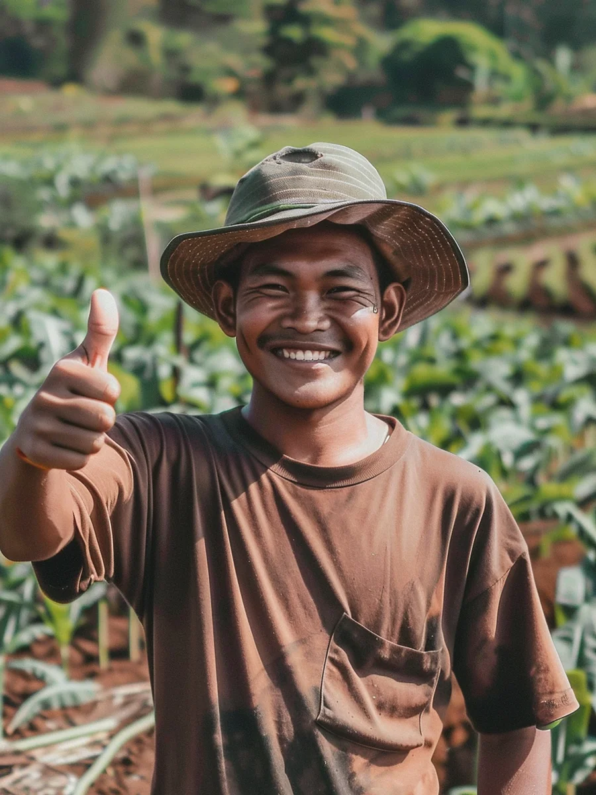
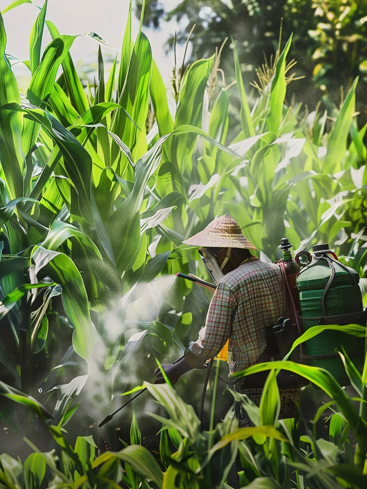
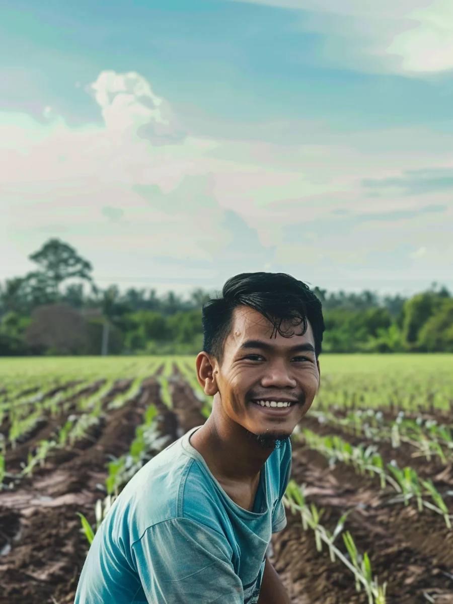
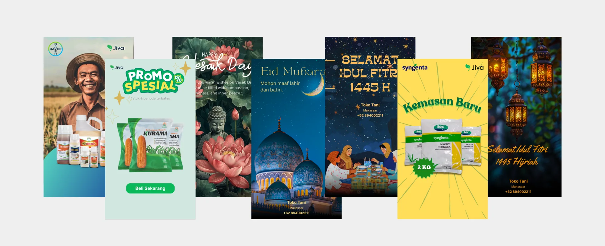

*This post started off as a talk proposal last year. It didn't end up getting selected. I recently found it in my drafts and decided to build on it and write about my Midjourney experiments from 2025.*

Jiva.ag [was](https://www.olamgroup.com/news/all-news/press-release/olam-group-to-closedown-jiva-ag-as-part-of-updated-2025-re-organisation-plan.html) an Agritech startup operating in Indonesia. Our operations spanned the entire agricultural ecosystem—we extended credit to farmers, purchased their harvests, supplied agro-retailers, and even sold our own white-labeled agricultural products.

We weren't just a tech company but one where our business required a strong physical presence on the ground. We regularly held activation events in small towns and villages (even sponsored a football team) which needed a steady stream of visual marketing materials. In the early days, the product design team pitched in to support marketing with everything from logo creation and Figma templates to t-shirt designs. Eventually we invested into creating a small, in-house Brand design team.

## Filling a representation gap

One of the first goals of the Brand design team was to come up with a new visual language. The original Jiva visual language had started to feel dated, and with our growing focus on agro-retailing, we needed a much brighter, more vibrant market presence. 

As part of this initiative, the team decided to anchor our new marketing collaterals around a heavily photograph-centric approach. However this created a new problem. Over the years, we had regularly invested in capturing film and photography content on the ground but this  approach required us to have a lot of images to work with. To make matters worse, the stock photo libraries we subscribed to were lacking when it came to representation of rural Indonesian folk. 

Getting a Midjourney Pro account, helped fill this gap. The team didn't need to wait for an on-ground team to go out on the field for creating assets for use. They could just generate them, or create variations of existing ones with little effort leading to short turnaround times.

 

---

## Speeding up a feature

Around the same time, [Juneza](https://www.junezaniyazi.com) was working with the retailers and noticed an un-met user need. Our retailers needed help marketing their store and with liquidating their stock. Solving this problem was important to us as we were about to launch our own Agri-brand; Jivaprodi.

Juneza's research had uncovered that the larger retailers did leverage digital marketing. Some of them used Instagram/Whatsapp to post Farmer testimonials while others advertized loyalty programs using Canva templates.

The business stakeholders felt that this was something we should be pursuing so a scrappy team of three; me, Kesha and Sivan, decided to take it up as a side project. For the MVP, I made a few mockups in Figma for leadership alignment and I started working on how AI Image generation would fit into this feature.

It was Ramadan, and Lebaran—the celebration marking the end of Ramadan, also known as *Eid al-Fitr*—was just a couple of weeks away. The entire country effectively slows down for the Lebaran holidays as people travel back to their often remote hometowns to be with their families.

For farmers, the timing was particularly relevant. Many would sell their harvest in the lead-up to this period, so they would have money to spend during Lebaran. It felt like the right moment to launch something that could help retailers remain top of mind with their customers.

Ofcourse there was not enough time. Back then, image generation was still early. We had just got AI to generate the right number of human appendages. But the tech was still too hallucinatory at that point (and still is) and it wasn't able to generate text either. We did not want any controversy so instead we went ahead with generating and curating the posters. In the end, we finalized six Ramadan greetings and three promotional posters.. The customization in this iteration was minimal. I made the posters using Figma and Canva and instead of getting user input, we decided to go and add the name and number from our system directly. 

#### Impact
We launched it right before the Lebaran week with a small marketing campaign. We even made [a short video](https://youtube.com/shorts/Y0XS6hAIy14) introducing the tool voiced by Kesha. And over the next few weeks, we saw that the users who used it kept coming back to share more. Every month we created and added more topical posters to the repo (with Fafa’s help). 

In just under 3 weeks, we were able to ship this feature out from design to development and 10% of our active users ended up sharing posters in that 1 week. This wouldnt have been possible without having access to generative AI imagery.

--- 

## Extending a design team's production capacity

I moved my focus to [Jiva Lite](http://kenneth.dsouza.im/work/jiva-lite), the new initiative that we had started working on (You can read about it [here](http://kenneth.dsouza.im/work/jiva-lite)). Jiva Lite was our attempt to simplify the crop procurement process via WhatsApp chat. It was designed to be lightweight and aimed to attract users primarily through digital channels.

As part of that initiative, we designed [websites](https://jivalite.vercel.app), created [onboarding videos](https://youtu.be/kCQByHg5kBI) and ofcourse ran ad campaigns. Facebook (meta) became a primary channel to deliver ads and during this process, I learnt that Facebook's ads come with an expiry date. Over a few weeks, every asset eventually reduces in terms of CTR and needs to be refreshed periodically. Sometimes it's obvious what works and other times, it isn't. We didn't have the design bandwidth to enable that constant creation and exploration. The brand design team was busy with the offline brand marketing collaterals and couldn't help us. So I decided to leverage Midjourney to create assets and use the newly released 'animate' feature to explore video ad creation. I assembled the final ad in Figma(image) or by using Instagram Story creator(video).

  <video src="/videos/toko-poster/jiva-lite-ad-1.mp4" poster="/videos/toko-poster/jiva-lite-ad-1.jpg" autoplay muted loop playsinline preload="metadata"></video>
  <video src="/videos/toko-poster/jiva-lite-ad-2.mp4" poster="/videos/toko-poster/jiva-lite-ad-2.jpg" autoplay muted loop playsinline preload="metadata"></video>
  <video src="/videos/toko-poster/jiva-lite-ad-3.mp4" poster="/videos/toko-poster/jiva-lite-ad-3.jpg" autoplay muted loop playsinline preload="metadata"></video>

---

I know it's hard to believe now but I was a AI skeptic back then. I was reluctant to use AI but these projects showed me the potential of the technology. It amplified our small design team at Jiva and enabled us to explore, experiment and deliver at a level that was not possible before. 

Today, I'm no longer a skeptic and use AI to bring my silly ideas into reality. But it's not just that, we've seen AI helping people to [find solutions to rare diseases](https://sagebio-rare-disease-real-kid-mva-hackathon-2026.hf.space), [save languages from extinction](https://www.bbc.com/audio/play/w3ct98zs) and even [attempt to identify patterns in animal communication](https://earthspecies.org/in-the-news/). Yes, there is a lot of uncertainity about the tech, and I do agree that there aren't enough safeguards or regulations in place. But never before has cutting edge tech been available at this scale to the general public and at such a subsidized price point. 

It's truly a strange, uncertain and genuinely interesting time to be alive. 