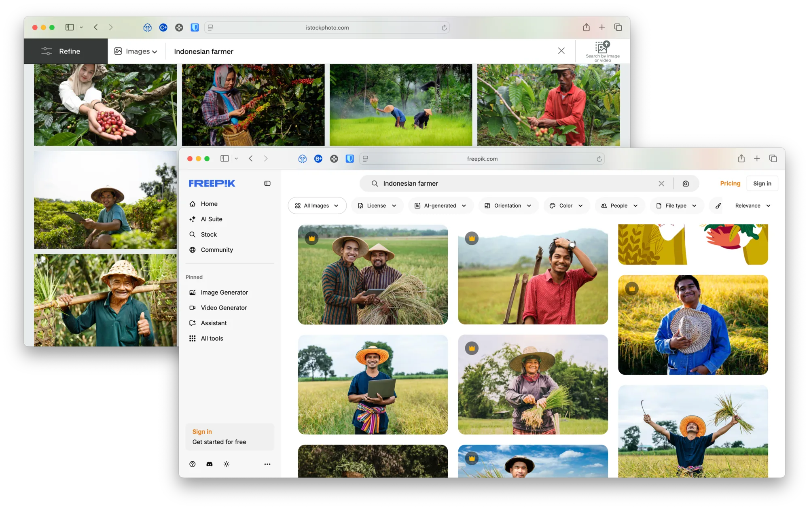
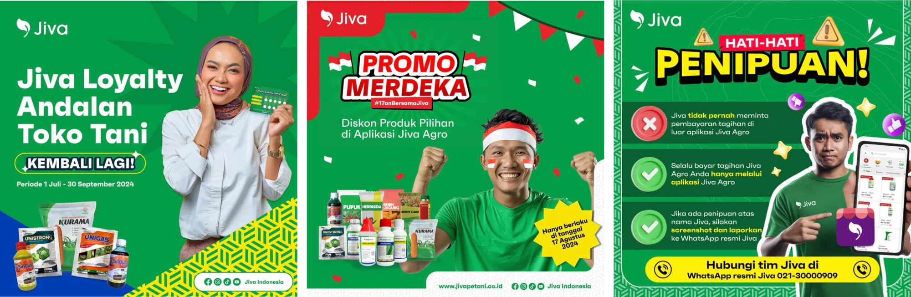
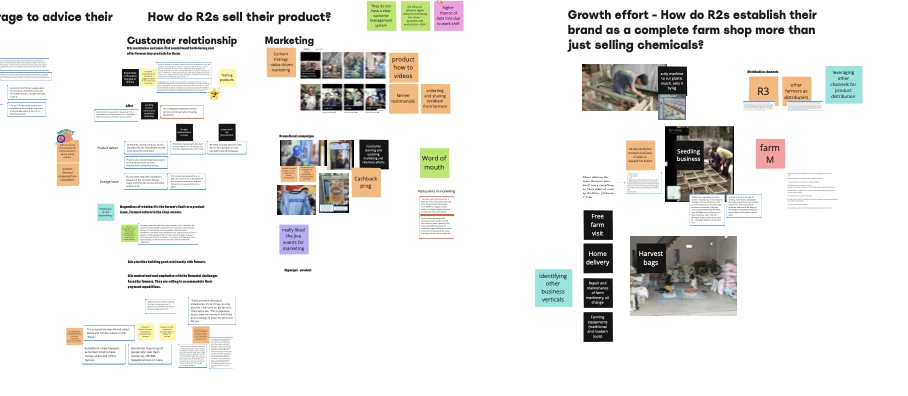
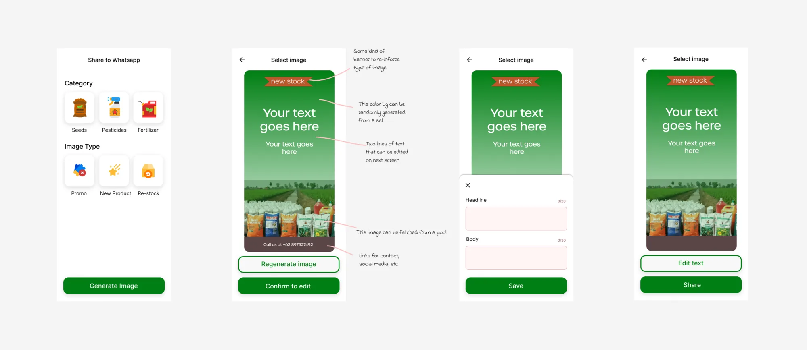
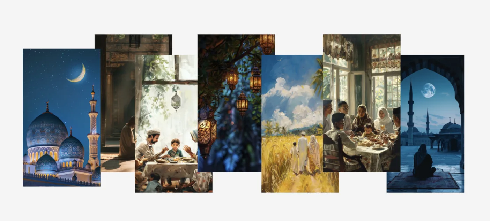
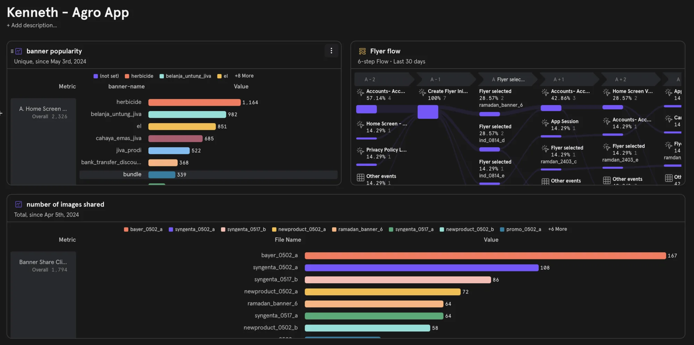

*This post started off as a talk proposal last year. It didn't end up getting selected. I recently found it in my drafts and decided to build on it and write about my Midjourney experiments from 2025.*

--- 

When Gen-AI launched couple of years ago, [Nav](https://navpawera.com) got the Jiva design team access to a Midjourney Pro subscription. At that time, the brand design team had just created their new external facing visual language and wanted to get started on creating on ground marketing for rural retailers; a new segment we were currently focussing on. 

However we found the currently stock photo libraries to be lacking when it came to representation of rural Indonesian folk and even our on-ground efforts towards creating film and photography content wasnt able to fill the void we had. 

With Midjourney, we were about to fill this gap by prompting models based on our existing image bank. This drastically sped up the turnaround time for the small team of 3 brand & comms designers. 

---

At about that time, [Juneza](https://www.junezaniyazi.com) was working with the retailers and noticed an un-addressed need. Our retailers needed help marketing their store and with liquidating their stock. Solving this problem was important to us as we were about to launch our own Agri-brand; Jivaprodi.

Apart from traditional sales & marketing approaches, we decided to try an AI assisted approach. During her research, Juneza had uncovered that the slightly larger retailers did leverage marketing. Some of them used Instagram to post Farmer testimonials while others advertized loyalty programs using Canva templates.

So we decided to work on a side project as a small team of three; me, Kesha and Sivan. I made a few mockups for leadership alignment and I started working on exploring Midjourney. 

Midjourney didn't have an official API plus the tech was too hallucinatory at that point (and still is). It wasn't able to generate text either back then. We did not want any controversy so instead we went ahead with generating and curating the posters.

Ramadan was just around the corner so we wanted to use that as a launch opportunity. There was not enough time, so we decided to go for a lean approach. In the end, we finalized 6 greetings for Ramadan and a 3 promotion posters. The customization in this iteration was minimal. So instead of getting user input, we decided to go and add the name and number from our system directly. 

And we launched it in the middle before the Lebaran week with a small marketing campaign. 

#### Impact
In just under 3 weeks, we were able to ship this feature out and 10% of our active users ended up sharing posters in that 1 week. 

And over the next few weeks, we saw that the users who used it kept coming back to share more. Every month we created and added more topical posters to the repo (with Fafa’s help). 

--- 

I moved to focussing on Jiva Lite, the new initiative that we wanted to pilot. (You can read about it [here](http://kenneth.dsouza.im/work/jiva-lite)). Jiva Lite was our attempt to simplify the crop procurement process via Whatsapp. Jiva Lite's was designed to be lightweight and aimed to attract it's users mainly via digital channels. As part of that initiative, we designed websites, created onboarding videos and created ads. I learnt that Facebook's ads come with an expiry date. Every asset eventually reduces in terms of CTR and needs to be refreshed periodically. But we didn't have the design bandwidth to enable that constant creation and exploration. The brand design team was busy with the offline brand marketing collaterals and couldn't help us. So we decided to leverage Midjourney to create ads and explore video ads. 

---

Finally, the  