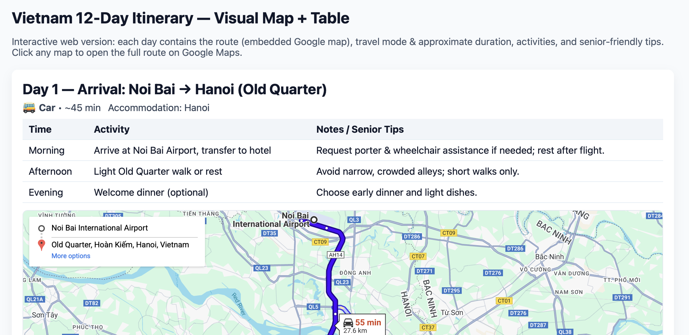
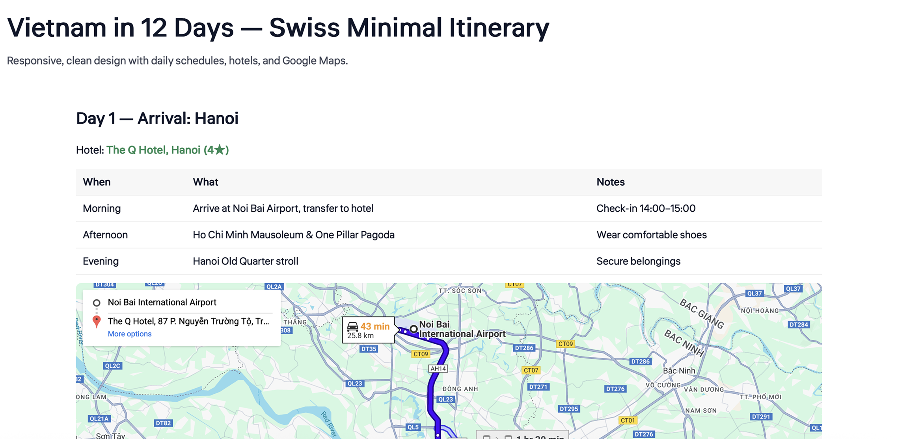
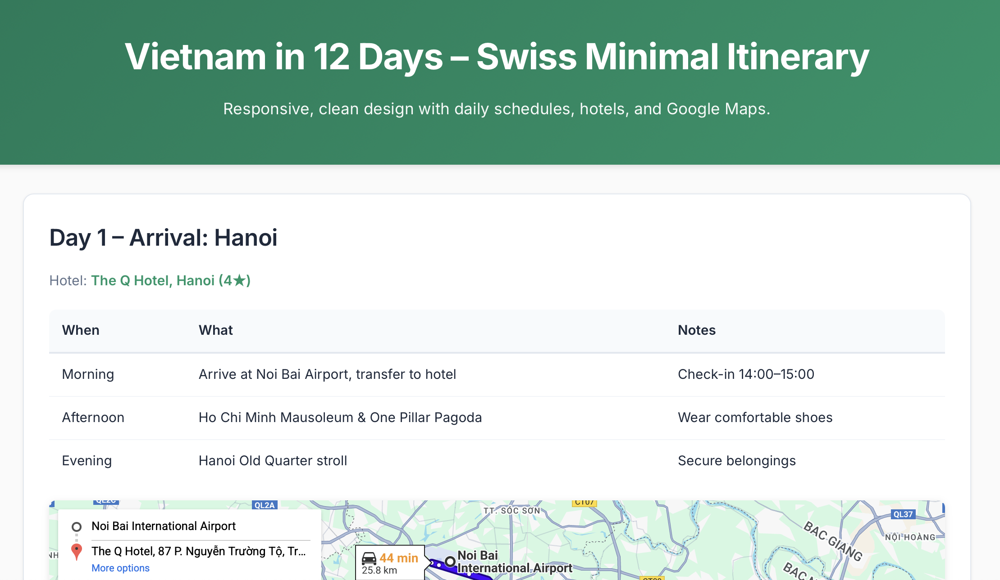
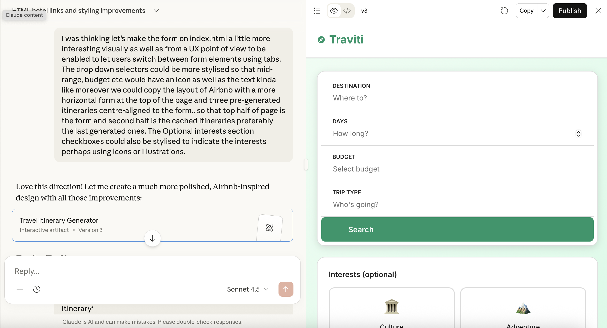
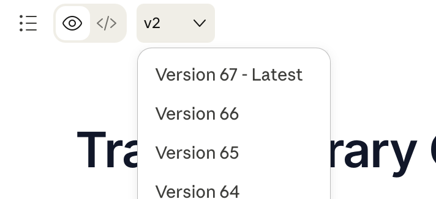
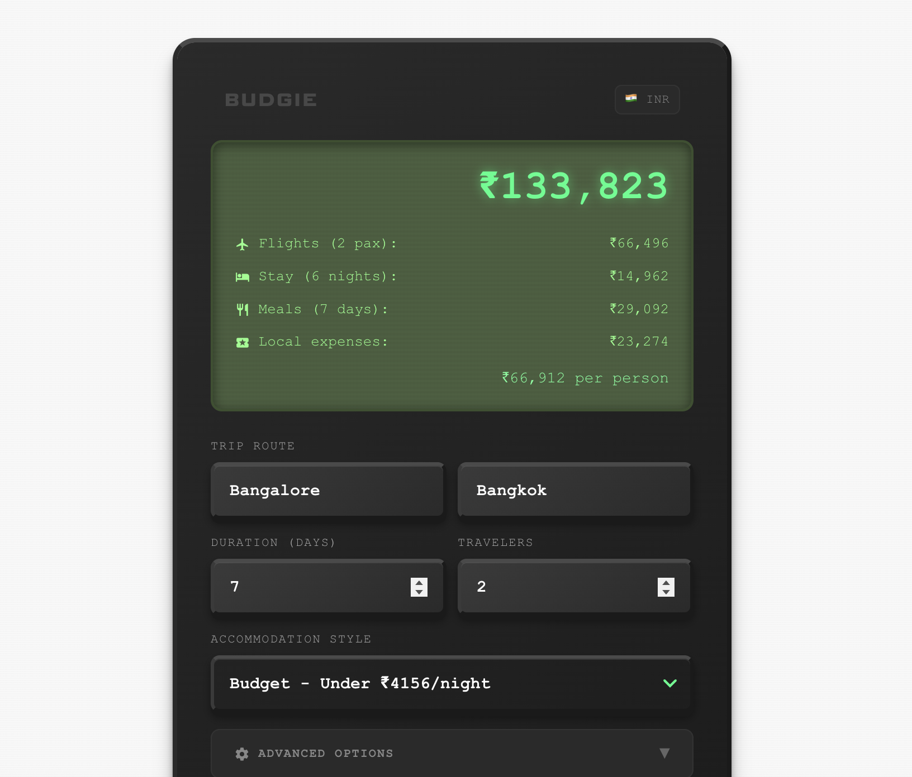

*Disclaimer: I had a shortlived career as a front end dev (IE7 era) at TCS when I began my career post-engineering in 2010, so I am familiar with the basics of web development. Hence vibe-coding on web may be slightly easier for me to grok then someone non-technical who is trying it out.*

In October, when I started off my break, I wanted to explore vibe coding but the choices are overwhelming. Up till then, my exposure to LLMs had been to use ChatGPT to edit blog posts and using Midjourney for creating assets for Meta Ads and VC pitch decks. Attending Razorpay’s Design x AI in November helped me understand the realities of vibe coding and prompting but I needed an extra push.

That push came in the form of a relative asking me to review their 'Vietnam Travel Itinerary'. They had shared their 'Itinerary as a huge wall of text pasted on Whatsapp. I could figure out a few obvious issues with it but I decided to see if AI can help me review and visualize the issues instead. I felt this would help me communicate the issues easier with my relative.

Planning holidays and building itineraries is a hobby of mine, so I had tried ChatGPT earlier to help with trip planning but I had found it lacking. It was great at generating rough to-dos for your trip like places to visit, etc which I believe it has adequate training data on and to be fair, it’s great for a normie. However, it fails miserably in many places like recommending good stays and other kinds of specialized interests and I've also observed that it tends to think about planning in terms of a western or american perspective. 

So I started asking ChatGPT to visualize the itinerary on maps and when it created an html artifact, I asked it to iterated on the design and visuals. But there was a lot of back and forth to get something done and often subsequent generations rolled back changes I had made. Below are couple of variations of my iterations, ([left](/vibe-coding/iterations/vietnam_12_day_itinerary_web.html)) from when I started to ([right](/vibe-coding/iterations/Vietnam_12Day_Itinerary.html)) when I decided to get it to make it swiss-inspired.

I hit chatGPT's session limit and decided to move it to Claude. That's when it got easier. Claude's execution of my requests were better. You could see an invisible multiplier in place such that a 1x simple prompt gave a [10x output](/vibe-coding/iterations/vietnam_itinerary.html). 

That piqued my curiousity, I decided to see how far I could go.

I first asked Claude what it would take to "productivize this" and it gave me a very detailed product roadmap of everything possible including the kitchen sink. It was overwhelming, but I made me learn that asking Claude for a plan is a good way to source ideas but better to work through the designs in the traditional way of implementation (prototype > iterate, repeat)

It took me about 40 iterations[^1] to get to a state I was comfortable sharing with friends to get feedback. Claude walked me through the steps of setting up Claude API key and hosting the app on Netlify, something I've never done before. You can check out the project at [Traviti](https://traviti.netlify.app/).

#### Fun fact: 
1. When I moved the html to Claude, it removed the 'Made by ChatGPT' label in the markup. Jealousy?
2. Claude struggled a lot to add it's own logo into the markup and I had to write the markup in the end.

This project gave me sort of confidence to build further. The itinerary generator was not what I would have wanted to build, but [Budgie](https://kenneth.dsouza.im/budgie/) was.  The time to build Budgie was faster. I now had Claude Pro subscription and quickly hit the weekly limit and had to stop so the v1 of Budgie took a week longer than expected to ship.

This was before Claude's release of Skills and I tried out using Projects for this. There was no Figma involved, just prompting and reading through CSS classes. There were some parts that I had to step into debug but largely this was coded by Claude.

Towards the end of this project, I moved to Claude Code on web and the experience dramatically improved again. Having Claude as a partner to pair with and write to the same repo was amazing QoL improvement. 

After Budgie, I felt it was time to stop procrastinating and start working on my portfolio (this site). It had been previously built on Eleventy via Glitch (RIP) but I wanted to test how easy would it be to re-write this. So for this project, I asked Claude Code to review and then rebuild the site in Astro and I also provided designs I made in Figma. Claude was easily able to render it and since then, I've taken to making Figma mockups to move the designs along. 

Midway through this, I decided to try Claude code on desktop and found myself lost a couple of times, so I decided to move back to Claude code on web. (I do want to try Claude code on Desktop for a future project where I build from scratch.)

Since then, I've tried my hands at [visualizing my book reading on P5js](https://kenneth.dsouza.im/books-2025/index.html) and tried to clean up [an old D3js assignment](https://kenneth.dsouza.im/visualizing-trains/) from a college module. 

Honestly, LLMs have been able to help me overcome the barriers I used to face with hobby side projects and I hope more people get empowered this way.

### Helpful tips if you want to get started

- Starting new chat is the new CTRL+S. I struggled a lot on regular chat conversation. Claude Code however generates a nice summary of the chat when you hit context limit.

- Be ready to make a LOT of iteratons. Designing on Figma and providing images has been generally efficient to get the outcome you want.  

- Start with small projects; for me that means static web projects. Identify what it means for you. 
  
- I expect design hiring to have a vibe coding round in the near future. Being able to translate your designs to a real functioning prototype has never been easier and moreover it gives an insight into how the designer solves problems.

-  Setup a free Github account and connect Claude to it. This will help with your versioning and the ability to roll back any unexpected changes. I personally prefer Github desktop over terminal and if you are new, I suggest you try that.

[^1]: At times, some of Claude's prompts generated multiple iterations so iteration 40 was more like 10 prompts into the conversation.
